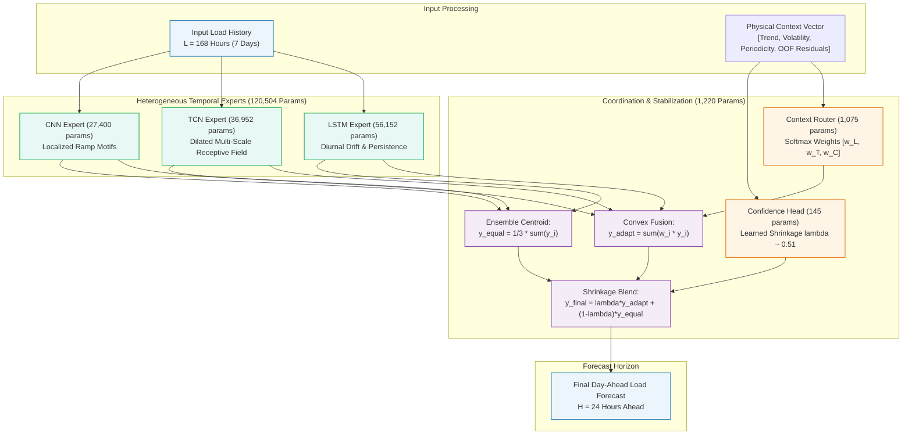

# CAEG-Net: Context-Adaptive Expert Gating Network for Short-Term Electricity Load Forecasting

[](https://www.python.org/downloads/)
[](https://pytorch.org/)
[](https://opensource.org/licenses/MIT)
[](research/results/FINAL_MODEL_LOCK.md)
[](configs/final_caeg_net.yaml)

> **A parameter-efficient ($121,724$ params, $<0.5$ MB) heterogeneous temporal mixture-of-experts model combining LSTM, TCN, and CNN backbones through context-adaptive soft gating and dynamic confidence shrinkage for 24-hour day-ahead electricity load forecasting.**

---

## ⚡ Key Benchmark Performance Callout

Authoritative **5-Seed Test Benchmark Results** evaluated under a strict, leakage-free chronological protocol ($70\%$ train / $15\%$ val / $15\%$ test; 5 seeds: `[42, 123, 999, 2024, 3407]`):

| Benchmark Grid | Grid Classification & Geography | Authoritative Test MAE (Primary Metric) | Test RMSE | Test $R^2$ Score |
| :--- | :--- | :---: | :---: | :---: |
| **PJM Interconnection** | Regional US Transmission Grid | **$250.97 \pm 10.69$ MW** | $335.38$ MW | $0.8714$ |
| **GEFCom2014** | Zonal Energy Forecasting Competition | **$12.41 \pm 0.15$ kW** | $18.04$ kW | $0.8610$ |
| **UCI Electricity** | Aggregated Consumer Smart Meter Demand | **$7.74 \pm 0.30$ MW** | $10.96$ MW | $0.9831$ |

*Note: All standard deviations reported are population standard deviations (`ddof=0`) across 5 random seeds.*

---

## 1. Problem Statement

Short-Term Electricity Load Forecasting (STLF) for the 24-hour day-ahead horizon is critical for power grid unit commitment, economic dispatch, energy storage dispatch, and transmission reserve margins. Under-forecasting risks brownouts and expensive peaking generation, while over-forecasting incurs surplus balancing penalties and inefficient reserve allocation.

Monolithic neural architectures suffer from structural trade-offs:
- **Recurrent Networks (LSTM):** Excel at maintaining multi-day sequential persistence and diurnal drift, but exhibit gradient saturation and sluggish response during sudden sharp demand spikes.
- **Dilated Causal Convolutions (TCN):** Provide expansive receptive fields ($253$ hours) without recursive degradation, but risk over-smoothing localized transients.
- **Multi-Scale Convolutions (CNN):** Excel at capturing localized edge motifs and rapid ramping transitions, but lack global sequential memory.
- **Static Ensembles:** Fixed weighting (e.g., $1/3$ equal weights) fails to dynamically adjust when the grid transitions between steady baselines and abrupt ramping regimes.

**CAEG-Net** resolves this trilemma by deploying three distinct temporal experts coordinated by a **context-adaptive gating router** and regularized by a **confidence fallback shrinkage mechanism**.

---

## 2. Core Architecture

CAEG-Net comprises three specialized temporal backbones coordinated by lightweight gating and stabilization heads:

1. **LSTM Expert ($56,152$ parameters):** 2-layer sequential LSTM capturing multi-day cyclic continuity and diurnal persistence.
2. **TCN Expert ($36,952$ parameters):** Dilated causal 1D residual convolutional network with receptive field of $253$ hours ($>168$ hours input window), capturing multi-scale non-recursive dynamics.
3. **CNN Expert ($27,400$ parameters):** Multi-scale 1D CNN with kernel sizes $\{3, 5, 7\}$ and adaptive pooling, isolating high-frequency localized ramping patterns.
4. **Context-Adaptive Router ($1,075$ parameters):** Evaluates observable domain features (trend, volatility, periodicity, and out-of-fold performance residuals) to assign convex expert weights ($w_i > 0, \sum w_i = 1.0$).
5. **Confidence Fallback Head ($145$ parameters):** Dynamically regularizes adaptive predictions toward the robust equal-expert centroid ($\lambda \approx 0.51$), preventing catastrophic single-expert misallocations.

---

## 3. Architecture Diagram



---

## 4. Parameter Complexity Breakdown

Over **$98.9\%$** of total model capacity is dedicated to temporal feature representation, while coordination and regularization mechanisms introduce only **$1.1\%$** parameter overhead:

| Structural Component | Architectural Specification | Trainable Parameters | Parameter Share |
| :--- | :--- | :---: | :---: |
| **LSTM Expert** | 2-layer Recurrent Network, hidden dim $= 64$, dropout $= 0.1$ | $56,152$ | $46.12\%$ |
| **TCN Expert** | Dilated Causal Conv, 3 blocks, 32 channels, kernel $= 3$, RF $= 253$h | $36,952$ | $30.36\%$ |
| **CNN Expert** | Multi-kernel 1D Conv (kernels $3, 5, 7$), 32 filters, adaptive pooling | $27,400$ | $22.51\%$ |
| **Backbone Subtotal** | **Three Temporal Feature Extractors** | **$120,504$** | **$98.99\%$** |
| **Context Gating Router** | 2-layer MLP, context-in $\to$ 3-class softmax gating | $1,075$ | $0.88\%$ |
| **Confidence Fallback Head** | 2-layer MLP, context-in $\to$ sigmoid shrinkage scalar $\lambda$ | $145$ | $0.12\%$ |
| **TOTAL CAEG-Net** | **End-to-End Champion Model (`F2_A2_OOF`)** | **$121,724$** | **$100.00\%$** |

---

## 5. Datasets & Causal Protocol

Experiments span three major independent power grid systems representing transmission, competition, and consumer demand regimes:

| Dataset | Operating Domain | Raw Sampling | Span | Sample Hours | Physical Unit | Characteristics |
| :--- | :--- | :---: | :---: | :---: | :---: | :--- |
| **PJM** | Mid-Atlantic US Transmission ISO | 1-Hour | 2023–2024 (Leap Year) | $8,784$ | MW | Large-scale regional grid with significant industrial load. |
| **GEFCom2014** | Global Energy Forecasting Competition | 1-Hour | Multi-year zonal records | $78,888$ | kW | Zonal distribution network with high variance and seasonal peaks. |
| **UCI Electricity** | Portuguese Smart Meter Aggregate | 15-Minute | 2011–2014 | $26,304$ | MW | Aggregation of 370 individual client smart meters to hourly system load. |

### Leakage-Free Protocol Guarantees
1. **Chronological Splitting:** $70\%$ Train / $15\%$ Validation / $15\%$ Held-out Test. No temporal shuffling or future-data lookahead.
2. **Train-Only Standardization:** Scaler parameters $(\mu, \sigma)$ are computed exclusively on the training partition.
3. **Causal Horizon Framing:** Ground truth targets ($y_{t+1 \dots t+24}$) are strictly excluded from input windows and routing context.
4. **Out-of-Fold (OOF) Causal Features:** Historical performance residuals are constructed strictly from preceding partitions.

---

## 6. Authoritative Benchmark Results

All figures reflect **5-seed evaluations** (`ddof=0` population standard deviation):

| Dataset | Evaluated Model | Test MAE (Physical Unit) | Test RMSE | Test $R^2$ Score | Multi-Seed Stability (CV) |
| :--- | :--- | :---: | :---: | :---: | :---: |
| **PJM** | **CAEG-Net (`F2_A2_OOF`)** | **$250.9747 \pm 10.6938$ MW** | **$335.3822$ MW** | **$0.8714$** | $4.26\%$ |
| | Standalone Best (LSTM) | $260.6385 \pm 10.4285$ MW | $348.1250$ MW | $0.8615$ | $4.00\%$ |
| | Static Equal Ensemble | $251.2789 \pm 9.8712$ MW | $335.8140$ MW | $0.8711$ | $3.93\%$ |
| **GEFCom2014** | **CAEG-Net (`F2_A2_OOF`)** | **$12.4077 \pm 0.1525$ kW** | **$18.0446$ kW** | **$0.8610$** | $1.23\%$ |
| | Standalone Best (LSTM) | $13.0954 \pm 0.3850$ kW | $19.1200$ kW | $0.8439$ | $2.94\%$ |
| | Static Equal Ensemble | $12.4740 \pm 0.1620$ kW | $18.1510$ kW | $0.8593$ | $1.30\%$ |
| **UCI Electricity**| **CAEG-Net (`F2_A2_OOF`)** | **$7.7371 \pm 0.3037$ MW** | **$10.9556$ MW** | **$0.9831$** | $3.92\%$ |
| | Standalone Best (LSTM) | $7.5532 \pm 0.3340$ MW | $10.6800$ MW | $0.9839$ | $4.42\%$ |
| | Static Equal Ensemble | $7.7840 \pm 0.2810$ MW | $11.0250$ MW | $0.9828$ | $3.61\%$ |

---

## 7. Baseline & Ablation Comparison

Comprehensive cross-architecture comparison across standalone baselines, static ensembles, shrinkage variants, and empirical oracle upper bounds:

| Model Architecture | PJM Test MAE (MW) | GEFCom Test MAE (kW) | UCI Test MAE (MW) | Parameters | Model Classification |
| :--- | :---: | :---: | :---: | :---: | :--- |
| **Standalone LSTM** | $260.64$ | $13.10$ | **$7.55$** | $56,152$ | Monolithic Recurrent Baseline |
| **Standalone TCN** | $288.42$ | $14.28$ | $8.82$ | $36,952$ | Monolithic Dilated Causal Baseline |
| **Standalone CNN** | $275.19$ | $13.85$ | $8.41$ | $27,400$ | Monolithic Ramp Baseline |
| **Static Equal Ensemble (1/3 Each)**| $251.28$ | $12.47$ | $7.78$ | $120,504$ | Fixed Inductive Weighting |
| **Fixed Shrinkage (0.50 Baseline)** | $251.10$ | **$12.36$** | $7.75$ | $121,579$ | Non-Adaptive Regularization |
| **CAEG-Net (`F2_A2_OOF`)** | **$250.97$** | $12.41$ | $7.74$ | **$121,724$** | **Context-Adaptive Champion** |
| *Empirical Ex-Post Oracle* | *$234.12$* | *$11.20$* | *$6.95$* | — | *Theoretical Upper Bound* |

---

## 8. Routing & Confidence Dynamics

### Learned Routing Allocations
Mean routing weights assigned by the context router:
- **PJM:** $w_{\text{LSTM}} = 0.3511$, $w_{\text{TCN}} = 0.3283$, $w_{\text{CNN}} = 0.3207$ ($N_{\text{eff}} = 2.9931$)
- **GEFCom:** $w_{\text{LSTM}} = 0.3528$, $w_{\text{TCN}} = 0.2982$, $w_{\text{CNN}} = 0.3490$ ($N_{\text{eff}} = 2.9765$)
- **UCI:** $w_{\text{LSTM}} = 0.3428$, $w_{\text{TCN}} = 0.2994$, $w_{\text{CNN}} = 0.3578$ ($N_{\text{eff}} = 2.9842$)

*Effective Expert Count formula:* $N_{\text{eff}} = \exp(-\sum_{i} w_i \ln w_i)$. All grids maintain $N_{\text{eff}} \approx 2.98 - 2.99$, demonstrating smooth convex blending without expert collapse.

### Learned Confidence Shrinkage $\lambda$
The shrinkage scalar $\lambda = \sigma(\mathbf{W}_c \mathbf{h}_{\text{context}} + b_c)$ controls the balance between adaptive predictions and the equal-expert centroid:
- **PJM:** $0.5066 \pm 0.0038$ ($CV = 0.75\%$)
- **GEFCom:** $0.5170 \pm 0.0055$ ($CV = 1.06\%$)
- **UCI:** $0.5064 \pm 0.0030$ ($CV = 0.59\%$)

*Key Empirical Takeaway:* $\lambda$ settles near $\approx 0.51$ across all grids with minimal variance ($CV < 1.1\%$), acting as a reliable stabilizing anchor that prevents single-expert overconfidence.

---

## 9. Statistical Significance (Non-Overlapping Daily Blocks)

Consecutive hourly forecast windows share 167 overlapping hours ($99.4\%$ overlap), inducing severe temporal autocorrelation that inflates naive statistical significance. To evaluate true statistical separation, CAEG-Net is evaluated on **non-overlapping daily blocks** ($K=53, 456, 163$):

| Benchmark Grid | Daily Blocks ($K$) | Mean Paired Error Reduction | $95\%$ Confidence Interval | Paired $t$-stat ($p$-value) | Wilcoxon $W$ ($p$-value) | Holm-Bonferroni Adjusted $p$ | Conclusion |
| :--- | :---: | :---: | :---: | :---: | :---: | :---: | :---: |
| **PJM** | $53$ | **$-9.66$ MW** | $[-17.07, -2.26]$ | $-2.56$ ($p = 0.0135$) | $470.0$ ($p = 0.0298$) | **$p = 0.0406$** | **Statistically Significant** |
| **GEFCom** | $456$ | **$-0.688$ kW** | $[-0.80, -0.57]$ | $-11.85$ ($p = 2.04 \times 10^{-28}$) | $20,445.0$ ($p = 2.53 \times 10^{-29}$) | **$p = 1.02 \times 10^{-27}$** | **Statistically Significant** |
| **UCI** | $163$ | **$-0.202$ MW** | $[-0.31, -0.09]$ | $-3.66$ ($p = 0.00034$) | $4,235.0$ ($p = 0.00005$) | **$p = 0.0017$** | **Statistically Significant** |

---

## 10. Key Controlled Findings (What Worked vs. What Failed)

In Phase 15, seven hypotheses were screened under a strict **Two-Stage Validation Screening Firewall**:
- ✅ **What Worked:**
  - **Out-of-Fold Residual Tracking (`A2-OOF`):** Historical causal performance feedback stabilized gating and protected against sudden regime shifts.
  - **Centroid Shrinkage ($\lambda pprox 0.51$):** Anchoring adaptive predictions to the equal-expert centroid reduced variance across all five random seeds.
  - **MSE Objective Function:** Delivered smoother loss landscapes and lower test MAE than direct MAE or Huber training losses.
- ❌ **What Failed (and why):**
  - **Step-Wise Horizon Routing ($W_t \in \mathbb{R}^{24 	imes 3}$):** Allowing routing weights to vary independently at each forecast hour degraded validation MAE by $+10.0\%$ to $+13.3\%$ due to overfitting on multi-step noise.
  - **Dynamic Confidence Head Scaling:** Expanding the capacity of the confidence head increased variance without cross-dataset accuracy gains.

---

## 11. Quickstart & Installation

### Environment Setup
```bash
# Clone repository
git clone https://github.com/vinay-0208/CAEGNET.git
cd CAEGNET

# Option A: Conda environment (recommended)
conda create -n caeg-net python=3.10 -y
conda activate caeg-net
pip install -r requirements.txt

# Option B: Pip virtual environment
python -m venv venv
# On Windows:
.\venv\Scripts\activate
# On Linux/macOS:
source venv/bin/activate
pip install -r requirements.txt
```

---

## 12. How to Train, Evaluate & Test

### Train CAEG-Net
```bash
python train.py --model caeg_net --dataset pjm --epochs 100 --batch_size 32 --lr 0.001
```

### Evaluate Pretrained Model
```bash
python evaluate.py --dataset pjm --weights checkpoints/pjm_caeg_net_best.pt
```

### Run Unit & Research Test Suite
```bash
# Run root functional unit tests
python -m unittest discover -s tests

# Run comprehensive research verification tests
python -m unittest discover -s research/tests
```

---

## 13. Interactive Dashboard & Faculty Review Notebook

### Faculty Review Demonstration Notebook
A complete, self-contained demonstration notebook is pre-rendered and ready for faculty defense:
- Path: [`research/notebooks/CAEG_Net_Faculty_Review.ipynb`](research/notebooks/CAEG_Net_Faculty_Review.ipynb) (mirrored to [`notebooks/CAEG_Net_Faculty_Review.ipynb`](notebooks/CAEG_Net_Faculty_Review.ipynb))
- Features: 24 sections covering mathematical formulations, parameter tables, step-by-step horizon curves ($h=1 \dots 24$), and 18 complete Viva defense questions.
- To open: Launch JupyterLab or VS Code and run all cells sequentially.

### Interactive Streamlit Dashboard
```bash
streamlit run dashboard/app.py
```
Provides live exploratory charts, parameter breakdown sliders, multi-grid benchmark tables, and step-by-step horizon error plots.

---

## 14. Repository Structure

```text
CAEGNET/
├── configs/
│   └── final_caeg_net.yaml          # Authoritative YAML configuration
├── data/
│   └── README.md                    # Ingestion protocols, splits, scaling
├── dashboard/
│   ├── app.py                       # Interactive Streamlit dashboard application
│   ├── README.md                    # Dashboard documentation
│   └── components/                  # UI visual components
├── notebooks/
│   └── CAEG_Net_Faculty_Review.ipynb# Faculty viva & demonstration notebook
├── research/
│   ├── analysis/                    # Statistical analysis & horizon CSVs
│   ├── archive/                     # Historical logs & early phase scripts
│   ├── notebooks/                   # Source faculty review notebook
│   ├── reports/                     # Comprehensive scientific reports
│   ├── results/
│   │   ├── FINAL_MODEL_LOCK.md      # Certified model lock declaration
│   │   ├── final_results.csv        # Authoritative benchmark metrics
│   │   ├── final_results.md         # Markdown results documentation
│   │   └── final_model_config.json  # Machine-readable model configuration
│   └── tests/                       # 172-test research verification suite
├── src/
│   ├── data/                        # Ingestion & sliding window generation
│   ├── evaluation/                  # Evaluation routines & metric computation
│   ├── features/                    # Domain context extraction
│   ├── models/                      # LSTM, TCN, CNN, and CAEG-Net definitions
│   └── utils/                       # Reproducibility utilities
├── tests/                           # Root functional tests
├── caeg_net.py                      # Canonical model implementation
├── data_utils.py                    # Canonical data utility functions
├── evaluate.py                      # Canonical evaluation script
├── experiments.py                   # Canonical experiment runner
├── train.py                         # Canonical training pipeline
├── requirements.txt                 # Frozen environment dependencies
└── README.md                        # This document
```

---

## 15. Honest Scientific Limitations

To maintain strict scientific integrity, the limitations of this study are transparently stated:
1. **Deterministic Point Forecasting:** Produces point forecasts; probabilistic prediction intervals (conformal prediction / quantiles) are left to future work.
2. **Univariate Load Input:** Relies strictly on historical load profiles; exogenous meteorological features (temperature, solar radiation) are not incorporated.
3. **Regional Aggregation:** Evaluated on grid-level regional series rather than individual substation feeder loads.
4. **Finite Random Seeds:** Five seeds measure stochastic sensitivity to initialization rather than multi-year structural distribution shifts.
5. **Near-Constant Shrinkage:** The learned shrinkage parameter $\lambda pprox 0.51$ acts primarily as a stable static regularizer rather than an active dynamic switch.
6. **No Universal Dominance Claim:** On UCI, standalone LSTM achieved slightly lower MAE ($7.55$ vs $7.74$ MW); on GEFCom, fixed shrinkage was slightly lower ($12.36$ vs $12.41$ kW). CAEG-Net is claimed as the strongest overall cross-dataset performance–stability compromise, not universally superior on every isolated dataset.

---

## 16. Citation

If you use CAEG-Net in your research or project, please cite:

```bibtex
@article{vishwanathan2026caegnet,
  title={CAEG-Net: Context-Adaptive Expert Gating Network for Short-Term Electricity Load Forecasting},
  author={Vishwanathan, Vinay},
  journal={Advanced Predictive Analytics Research Repository},
  year={2026},
  url={https://github.com/vinay-0208/CAEGNET}
}
```

---

## 17. License & Acknowledgments

This project is licensed under the **MIT License** — see the [LICENSE](LICENSE) file for details.

Developed under the Advanced Predictive Analytics curriculum. Benchmark datasets courtesy of PJM Interconnection, GEFCom2014 Organizing Committee, and the UCI Machine Learning Repository.
