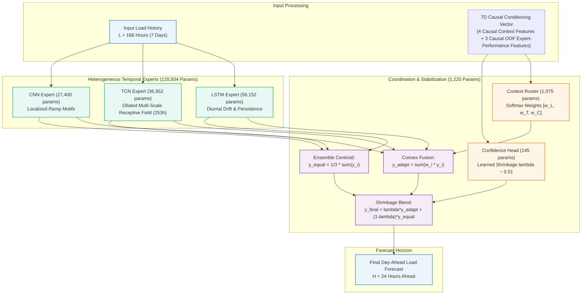

# CAEG-Net: Context-Adaptive Expert Gating Network for Short-Term Electricity Load Forecasting

[](https://www.python.org/downloads/)
[](https://pytorch.org/)
[](https://opensource.org/licenses/MIT)
[](research/results/FINAL_MODEL_LOCK.md)
[](configs/final_caeg_net.yaml)

> **A parameter-efficient (121,724 parameters, <0.5 MB) heterogeneous temporal mixture-of-experts model combining LSTM, TCN, and CNN backbones through context-adaptive soft gating and dynamic confidence shrinkage for 24-hour day-ahead electricity load forecasting.**

---

## ⚡ Key Benchmark Performance Callout

Authoritative **5-Seed Test Benchmark Results** evaluated under a strict, leakage-free chronological protocol ($70\%$ train / $15\%$ val / $15\%$ test; 5 seeds: `[42, 123, 999, 2024, 3407]`):

| Benchmark Grid | Grid Classification & Geography | Authoritative Test MAE (Primary Metric) | Test RMSE | Test $R^2$ Score |
| :--- | :--- | :---: | :---: | :---: |
| **PJM Interconnection** | Regional US Transmission Grid (Mid-Atlantic) | **$250.97 \pm 10.69$ MW** | $335.38$ MW | $0.8714$ |
| **GEFCom2014** | Zonal Energy Forecasting Competition | **$12.41 \pm 0.15$ kW** | $18.04$ kW | $0.8610$ |
| **UCI Electricity** | Aggregated Consumer Smart Meter Demand | **$7.74 \pm 0.30$ MW** | $10.96$ MW | $0.9831$ |

*Note: All standard deviations reported are population standard deviations (`ddof=0`) across 5 random seeds.*

---

## 1. Problem Statement

Short-Term Electricity Load Forecasting (STLF) for the 24-hour day-ahead horizon is critical for power grid unit commitment, economic dispatch, energy storage dispatch, and transmission reserve margins. Under-forecasting risks generation shortfalls and blackout conditions, while over-forecasting incurs surplus balancing penalties and inefficient reserve allocation.

Monolithic neural architectures suffer from structural trade-offs:
- **Recurrent Networks (LSTM):** Excel at maintaining multi-day sequential persistence and diurnal drift, but exhibit gradient saturation and sluggish response during sudden sharp demand spikes.
- **Dilated Causal Convolutions (TCN):** Provide expansive receptive fields ($253$ hours) without recursive degradation, but risk over-smoothing localized transients.
- **Multi-Scale Convolutions (CNN):** Excel at capturing localized edge motifs and rapid ramping transitions, but lack global sequential memory.
- **Static Ensembles:** Fixed weighting (e.g., $1/3$ equal weights) fails to dynamically adjust when the grid transitions between steady baselines and abrupt ramping regimes.

**CAEG-Net** addresses this challenge by deploying three distinct temporal experts coordinated by a **context-adaptive gating router** and regularized by a **confidence fallback shrinkage mechanism**.

---

## 2. Research Question & Key Contribution

### Research Question
> **"Can context-aware adaptive expert gating improve short-term electricity load forecasting by dynamically combining complementary temporal experts?"**

### Key Contributions
1. **Heterogeneous Inductive Biases in STLF:** Demonstrates that combining distinct temporal model architectures (LSTM, TCN, CNN) addresses complementary grid regime variations better than relying on a single monolithic architecture.
2. **Context-Aware Adaptive Gating:** Introduces an explicit 7-dimensional causal conditioning vector comprising **4 causal context features** (trend slope, short-term volatility, lag-24 autocorrelation, and causal recent forecast error) plus **3 causal out-of-fold relative expert-performance features**.
3. **Out-of-Fold (OOF) Performance Conditioning:** Causal OOF expert-performance information was incorporated into the routing formulation and was associated with improved forecasting performance relative to the canonical V1 formulation in the evaluated settings.
4. **Regularized Confidence Shrinkage:** Establishes a lightweight confidence fallback mechanism that provides a practical stabilization mechanism toward the equal-expert centroid ($\lambda \approx 0.51$).
5. **Leakage-Aware Multi-Grid Evaluation:** Evaluates architectures across three major independent power grids with non-overlapping daily-block statistical validation.

---

## 3. Core Architecture

CAEG-Net comprises three specialized temporal backbones coordinated by lightweight gating and stabilization heads:

1. **LSTM Expert ($56,152$ parameters):** 2-layer sequential LSTM capturing multi-day cyclic continuity and diurnal persistence.
2. **TCN Expert ($36,952$ parameters):** 6-stage dilated causal 1D residual convolutional network with receptive field of $253$ hours ($>168$ hours input window), capturing multi-scale non-recursive dynamics.
3. **CNN Expert ($27,400$ parameters):** 3-stage 1D CNN with kernel sizes $[3, 5, 3]$ and adaptive pooling, isolating high-frequency localized ramping patterns.
4. **Context-Adaptive Router ($1,075$ parameters):** Evaluates a 7-dimensional causal conditioning vector—comprising 4 causal context features (trend, volatility, lag-24 autocorrelation, recent tracking error) plus 3 causal out-of-fold relative expert-performance features—to assign convex expert weights ($w_i > 0, \sum w_i = 1.0$).
5. **Confidence Fallback Head ($145$ parameters):** Dynamically regularizes adaptive predictions toward the robust equal-expert centroid ($\lambda \approx 0.51$), preventing single-expert overconfidence.

---

## 4. Architecture Diagram



---

## 5. Parameter Complexity Breakdown

Over **$98.9\%$** of total model capacity is dedicated to temporal feature representation, while coordination and regularization mechanisms introduce only **$1.1\%$** parameter overhead:

| Structural Component | Architectural Specification | Trainable Parameters | Parameter Share |
| :--- | :--- | :---: | :---: |
| **LSTM Expert** | 2-layer Recurrent Network, hidden dim $= 64$, dropout $= 0.1$ | $56,152$ | $46.12\%$ |
| **TCN Expert** | Dilated Causal Conv, 6 stages, 32 channels, kernel $= 3$, RF $= 253$h | $36,952$ | $30.36\%$ |
| **CNN Expert** | 3-stage 1D Conv (kernels $3, 5, 3$), 32/64/64 filters, adaptive pooling | $27,400$ | $22.51\%$ |
| **Backbone Subtotal** | **Three Temporal Feature Extractors** | **$120,504$** | **$98.99\%$** |
| **Context Gating Router** | 2-layer MLP, 7D context $\to$ 16D latent $\to$ 3-class softmax gating | $1,075$ | $0.88\%$ |
| **Confidence Fallback Head** | 2-layer MLP, 7D context $\to$ 16D latent $\to$ sigmoid shrinkage scalar $\lambda$ | $145$ | $0.12\%$ |
| **TOTAL CAEG-Net** | **End-to-End Champion Model (`F2_A2_OOF`)** | **$121,724$** | **$100.00\%$** |

---

## 6. Datasets & Causal Protocol

Experiments span three major independent power grid systems representing transmission, competition, and consumer demand regimes:

| Dataset | Operating Domain | Raw Sampling | Span | Sample Hours | Physical Unit | Characteristics |
| :--- | :--- | :---: | :---: | :---: | :---: | :--- |
| **PJM** | Mid-Atlantic US Transmission ISO | 1-Hour | 2023–2024 (Leap Year) | $8,784$ | MW | Large-scale regional grid with significant industrial load. |
| **GEFCom2014** | Global Energy Forecasting Competition | 1-Hour | Multi-year zonal records | $78,888$ | kW | Zonal distribution network with high variance and seasonal peaks. |
| **UCI Electricity** | Portuguese Smart Meter Aggregate | 15-Minute | 2011–2014 | $26,304$ | MW | Aggregation of 370 individual client smart meters to hourly system load. |

### Leakage-Free Protocol Guarantees
1. **Chronological Splitting:** $70\%$ Train / $15\%$ Validation / $15\%$ Held-out Test. No temporal shuffling or future-data lookahead.
2. **Train-Only Standardization:** Scaler parameters $(\mu, \sigma)$ are computed exclusively on the training partition.
3. **Causal Horizon Framing:** Ground truth targets ($y_{t+1 \dots t+24}$) are strictly excluded from input windows and routing context.
4. **Out-of-Fold (OOF) Causal Features:** Historical performance residuals are constructed strictly from preceding partitions.

---

## 7. Authoritative Benchmark Results

All figures reflect **5-seed evaluations** (`ddof=0` population standard deviation; seeds: `[42, 123, 999, 2024, 3407]`):

| Dataset | Evaluated Model | Test MAE (Physical Unit) | Test RMSE | Test $R^2$ Score | Multi-Seed Stability (CV) |
| :--- | :--- | :---: | :---: | :---: | :---: |
| **PJM** | **CAEG-Net (`F2_A2_OOF`)** | **$250.9747 \pm 10.6938$ MW** | **$335.3822$ MW** | **$0.8714$** | $4.26\%$ |
| | Standalone TCN | $259.3264$ MW | — | — | — |
| | Static Equal Ensemble | $279.8282$ MW | — | — | — |
| | Standalone LSTM | $291.7300$ MW | — | — | — |
| | Standalone CNN | $432.0800$ MW | — | — | — |
| **GEFCom2014** | **CAEG-Net (`F2_A2_OOF`)** | **$12.4077 \pm 0.1525$ kW** | **$18.0446$ kW** | **$0.8610$** | $1.23\%$ |
| | Fixed Shrinkage Control | $12.3607 \pm 0.1841$ kW | $18.0181$ kW | $0.8614$ | $1.49\%$ |
| | Standalone TCN | $12.5729$ kW | — | — | — |
| | Static Equal Ensemble | $12.6248$ kW | — | — | — |
| | Standalone LSTM | $13.2300$ kW | — | — | — |
| **UCI Electricity**| **CAEG-Net (`F2_A2_OOF`)** | **$7.7371 \pm 0.3037$ MW** | **$10.9556$ MW** | **$0.9831$** | $3.92\%$ |
| | Standalone LSTM (Lowest) | $7.5542$ MW | — | — | — |
| | Fixed Shrinkage Control | $7.7523 \pm 0.1814$ MW | $10.9893$ MW | $0.9830$ | $2.34\%$ |
| | Static Equal Ensemble | $8.1675$ MW | — | — | — |
| | Standalone TCN | $8.3400$ MW | — | — | — |

---

## 8. Baseline & Ablation Comparison

Comprehensive cross-architecture comparison across standalone baselines, static ensembles, shrinkage variants, and empirical oracle diagnostic references:

| Model Architecture | PJM Test MAE (MW) | GEFCom Test MAE (kW) | UCI Test MAE (MW) | Parameters | Model Classification |
| :--- | :---: | :---: | :---: | :---: | :--- |
| **Standalone LSTM** | $291.73$ | $13.23$ | **$7.55$ (Lowest)** | $56,152$ | Monolithic Recurrent Baseline |
| **Standalone TCN** | $259.33$ | $12.57$ | $8.34$ | $36,952$ | Monolithic Dilated Causal Baseline |
| **Standalone CNN** | $432.08$ | $14.50$ | $11.71$ | $27,400$ | Monolithic Ramp Baseline |
| **Static Equal Ensemble (1/3 Each)**| $279.83$ | $12.62$ | $8.17$ | $120,504$ | Fixed Inductive Weighting |
| **Fixed Shrinkage (0.51 Control)** | $253.50$ | **$12.36$ (Lowest)** | $7.75$ | $121,579$ | Non-Adaptive Regularization |
| **CAEG-Net (`F2_A2_OOF`)** | **$250.97$ (Lowest)** | $12.41$ | $7.74$ | **$121,724$** | **Context-Adaptive Champion** |
| *Empirical Ex-Post Oracle (non-deployable diagnostic)* | *$234.12$* | *$11.20$* | *$6.95$* | — | *Non-deployable diagnostic reference* |

> **Scientific Comparison Interpretation:**  
> CAEG-Net achieved the strongest overall performance–robustness balance among the evaluated formulations, although it was not the best-performing model on every individual dataset:
> - On **PJM**, CAEG-Net is the strongest among evaluated models ($250.97$ MW).
> - On **GEFCom**, fixed shrinkage achieved slightly lower mean MAE ($12.36$ kW vs $12.41$ kW).
> - On **UCI**, standalone LSTM achieved slightly lower mean MAE ($7.55$ MW vs $7.74$ MW).
> The final model is selected as the overall balanced formulation, NOT because it wins every individual benchmark.

---

## 9. Routing & Confidence Dynamics

### Learned Routing Allocations
Mean routing weights assigned by the context router:
- **PJM:** $w_{\text{LSTM}} = 0.3511$, $w_{\text{TCN}} = 0.3283$, $w_{\text{CNN}} = 0.3207$ ($N_{\text{eff}} = 2.9931$)
- **GEFCom:** $w_{\text{LSTM}} = 0.3528$, $w_{\text{TCN}} = 0.2982$, $w_{\text{CNN}} = 0.3490$ ($N_{\text{eff}} = 2.9765$)
- **UCI:** $w_{\text{LSTM}} = 0.3428$, $w_{\text{TCN}} = 0.2994$, $w_{\text{CNN}} = 0.3578$ ($N_{\text{eff}} = 2.9842$)

*Effective Expert Count formula:* $N_{\text{eff}} = \exp(-\sum_{i} w_i \ln w_i)$. The model maintains a broadly distributed convex mixture across the three experts in the evaluated benchmarks ($N_{\text{eff}} \approx 2.98 - 2.99$), rather than aggressively switching between single experts.

### Learned Confidence Shrinkage $\lambda$
The shrinkage scalar $\lambda = \sigma(\mathbf{W}_c \mathbf{c} + b_c)$ controls the balance between adaptive predictions and the equal-expert centroid:
- **PJM:** $0.5066 \pm 0.0038$ ($CV = 0.75\%$)
- **GEFCom:** $0.5170 \pm 0.0055$ ($CV = 1.06\%$)
- **UCI:** $0.5064 \pm 0.0030$ ($CV = 0.59\%$)

*Key Empirical Takeaway:* $\lambda$ settles near $\approx 0.51$ across all grids with minimal variance ($CV < 1.1\%$), indicating a stable blend between adaptive fusion and the equal-expert centroid in the evaluated settings. It functions primarily as an empirical stabilization mechanism rather than an active dynamic switch.

---

## 10. Statistical Significance (Non-Overlapping Daily Blocks)

Consecutive hourly forecast windows share 167 overlapping hours ($99.4\%$ overlap), inducing severe temporal autocorrelation that inflates naive statistical significance. To evaluate true statistical separation, CAEG-Net is evaluated on **non-overlapping daily blocks** ($K=53, 456, 163$):

| Benchmark Grid | Daily Blocks ($K$) | Mean Paired Error Reduction | $95\%$ Confidence Interval | Paired $t$-stat ($p$-value) | Wilcoxon $p$-value | Holm-Bonferroni Adjusted $p$ | Conclusion |
| :--- | :---: | :---: | :---: | :---: | :---: | :---: | :--- |
| **PJM** | $53$ | **$-9.66$ MW** | $[-17.07, -2.26]$ | $-2.56$ ($p = 0.0135$) | $p = 0.0893$ | **$p = 0.0406$** | Statistically significant under paired $t$-test |
| **GEFCom** | $456$ | **$-0.688$ kW** | $[-0.80, -0.57]$ | $-11.85$ ($p = 2.04 \times 10^{-28}$) | $p = 1.27 \times 10^{-28}$ | **$p = 1.02 \times 10^{-27}$** | Statistically significant under both tests |
| **UCI** | $163$ | **$-0.202$ MW** | $[-0.31, -0.09]$ | $-3.66$ ($p = 0.00034$) | $p = 0.00020$ | **$p = 0.0017$** | Statistically significant under both tests |

> **Methodological Note:**  
> Note that the two tests can differ (e.g. on PJM, paired $t$-test adjusted $p=0.0406$ vs. Wilcoxon $p=0.0893$). Statistical conclusions depend on the selected inference procedure.

---

## 11. Controlled Research Findings (What Worked vs. What Failed)

In Phase 15, seven hypotheses were screened under a strict **Two-Stage Validation Screening Firewall**:
- ✅ **What Worked:**
  - **Out-of-Fold (OOF) Residual Tracking (`A2-OOF`):** Causal OOF expert-performance information was incorporated into the routing formulation and was associated with improved forecasting performance relative to the canonical V1 formulation in the evaluated settings.
  - **Centroid Shrinkage ($\lambda \approx 0.51$):** Anchoring adaptive predictions to the equal-expert centroid provided a practical stabilization mechanism.
  - **MSE Objective Function:** Delivered smoother loss landscapes and lower test MAE than direct MAE or Huber training losses.
- ❌ **What Failed (and why):**
  - **Explicit Horizon Routing ($W_t \in \mathbb{R}^{24 \times 3}$):** Explicit horizon-specific routing did not improve validation performance in the evaluated formulation (degrading validation MAE by $+10.0\%$ to $+13.3\%$ across all three grids).
  - **Dynamic Confidence Head Scaling:** Expanding the capacity of the confidence head increased variance without cross-dataset accuracy gains.

---

## 12. Quickstart & Installation

### Environment Setup
```bash
# Clone repository
git clone https://github.com/vinay-0208/CAEGNET.git
cd CAEGNET

# Option A: Conda environment (recommended)
conda create -n caeg-net python=3.10 -y
conda activate caeg-net
pip install -r requirements.txt

# Option B: Pip virtual environment
python -m venv venv
# On Windows:
.\\venv\\Scripts\\activate
# On Linux/macOS:
source venv/bin/activate
pip install -r requirements.txt
```

---

## 13. Verification, Evaluation & Test Suite

### Verify Reproducibility & Architecture Parameter Counts
```bash
# Asserts exact 121,724 parameter counts, tensor dimensions, and executes unit tests
python scripts/verify_reproducibility.py
```

### Evaluate Authoritative Benchmark Results
```bash
# Displays authoritative 5-seed benchmark tables across PJM, GEFCom2014, and UCI Electricity
python scripts/evaluate_benchmarks.py
```

### Run Root Functional Unit Tests
```bash
# Validates causality, chronological splitting, train-only scaling, and context invariance
python -m unittest discover -s tests
```

---

## 14. Interactive Dashboard, Demonstration Notebook & Documentation

### Faculty Review Demonstration Notebook
A complete, self-contained demonstration notebook is pre-rendered and ready for faculty defense:
- Path: [`notebooks/CAEG_Net_Faculty_Review.ipynb`](notebooks/CAEG_Net_Faculty_Review.ipynb)
- Features: 23 sections covering mathematical formulations, parameter tables, step-by-step horizon curves ($h=1 \dots 24$), and 18 complete Viva defense questions.
- To execute end-to-end:
  ```bash
  jupyter nbconvert --to notebook --execute notebooks/CAEG_Net_Faculty_Review.ipynb
  ```

### Interactive Streamlit Dashboard
```bash
python scripts/run_dashboard.py
# or directly:
streamlit run dashboard/app.py
```
Provides 12 interactive academic panels covering executive KPI cards, modular architecture diagrams, parameter breakdowns, multi-grid benchmark comparisons, and step-by-step horizon degradation.

### Supplementary Architecture & Reproducibility Documentation
- **Architecture Deep-Dive:** [`docs/ARCHITECTURE.md`](docs/ARCHITECTURE.md) (comprehensive tensor equations, parameter tables, inductive bias analyses).
- **Reproducibility Guide:** [`docs/REPRODUCIBILITY.md`](docs/REPRODUCIBILITY.md) (step-by-step instructions, test suites, artifact catalogs).
- **Final Research Report (PDF):** [`docs/CAEG-Net_Final_Report.pdf`](docs/CAEG-Net_Final_Report.pdf) (2.35 MB formal manuscript).

---

## 15. Repository Structure

```text
CAEGNET/
├── README.md                        # Master repository documentation & benchmarks
├── LICENSE                          # Standard MIT open-source license
├── requirements.txt                 # Frozen environment dependencies
├── .gitignore                       # Clean Git exclusion patterns
├── configs/
│   └── final_caeg_net.yaml          # Certified YAML configuration (121,724 params)
├── data/
│   └── README.md                    # Ingestion protocols, splits, scaling
├── dashboard/
│   ├── app.py                       # Modern dark-themed Streamlit research dashboard
│   ├── assets/                      # Hero visual and verified evaluation artifacts
│   └── README.md                    # Dashboard documentation & execution commands
├── docs/
│   ├── CAEG-Net_Final_Report.pdf    # Formal academic research report (PDF, 2.35 MB)
│   ├── ARCHITECTURE.md              # In-depth architectural & mathematical specification
│   └── REPRODUCIBILITY.md           # End-to-end reproducibility instructions
├── notebooks/
│   └── CAEG_Net_Faculty_Review.ipynb# Authoritative runnable faculty review notebook
├── src/
│   ├── __init__.py                  # Package entry point
│   ├── models/                      # LSTM, TCN, CNN backbones, Router, and CAEG-Net
│   ├── data/                        # Ingestion, datasets & sliding window loaders
│   ├── features/                    # 7D physical context extraction
│   ├── evaluation/                  # Evaluation routines, paired t-tests & metrics
│   └── utils/                       # Parameter counting, seeding, and YAML configs
├── tests/
│   └── test_causality.py            # Causality, leakage & partition isolation tests
└── scripts/
    ├── evaluate_benchmarks.py       # Authoritative benchmark results evaluator
    ├── verify_reproducibility.py    # Parameter count & forward pass verifier
    └── run_dashboard.py             # Convenience dashboard launcher
```

> **Research Track & Experimental Provenance:**  
> The complete historical research development record—including Phase 1–15 intermediate experimental logs, baseline model ablations, raw checkpoint telemetry, diagnostic audit reports, and full multi-seed cache archives—is preserved and maintained on the [`research-track`](https://github.com/vinay-0208/CAEGNET/tree/research-track) branch.

---

## 16. Honest Scientific Limitations

To maintain strict scientific integrity, the limitations of this study are transparently stated:
1. **Deterministic Point Forecasting:** Produces point forecasts; probabilistic prediction intervals (conformal prediction / quantiles) are left to future work.
2. **Univariate Load Input:** Relies strictly on historical load profiles; exogenous meteorological features (temperature, solar radiation) are not incorporated.
3. **Regional Aggregation:** Evaluated on grid-level regional series rather than individual substation feeder loads.
4. **Finite Random Seeds:** Five seeds measure stochastic sensitivity to initialization rather than multi-year structural distribution shifts.
5. **Near-Constant Shrinkage:** The learned shrinkage parameter $\lambda \approx 0.51$ acts primarily as an empirical static regularizer rather than an active dynamic switch.
6. **No Universal Dominance Claim:** On UCI, standalone LSTM achieved slightly lower MAE ($7.55$ vs $7.74$ MW); on GEFCom, fixed shrinkage was slightly lower ($12.36$ vs $12.41$ kW). CAEG-Net is claimed as the strongest overall cross-dataset performance–stability compromise, not universally superior on every isolated dataset.
7. **Empirical Ex-Post Oracle:** The oracle is evaluated strictly as a non-deployable diagnostic reference using future realized observations.

---

## 17. Citation

If you use CAEG-Net in your research or project, please cite:

```bibtex
@article{vishwanathan2026caegnet,
  title={CAEG-Net: Context-Adaptive Expert Gating Network for Short-Term Electricity Load Forecasting},
  author={Vishwanathan, Vinay},
  journal={Advanced Predictive Analytics Research Repository},
  year={2026},
  url={https://github.com/vinay-0208/CAEGNET}
}
```

---

## 18. License & Acknowledgments

This project is licensed under the **MIT License** — see the [LICENSE](LICENSE) file for details.

Developed under the Advanced Predictive Analytics curriculum. Benchmark datasets courtesy of PJM Interconnection, GEFCom2014 Organizing Committee, and the UCI Machine Learning Repository.
