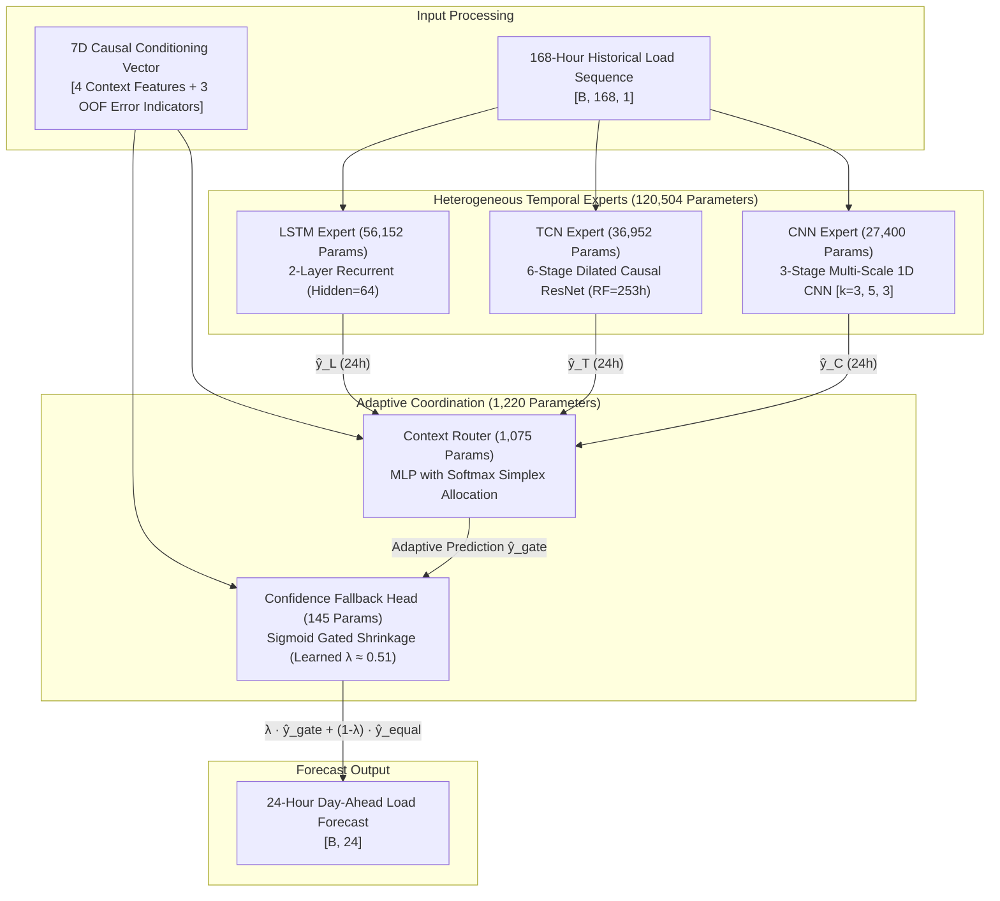

# CAEG-Net
### Context-Adaptive Expert Gating Network for Short-Term Electricity Load Forecasting

[](LICENSE)
[](requirements.txt)
[](requirements.txt)
[](configs/final_caeg_net.yaml)

---

## Overview

**CAEG-Net** (Context-Adaptive Expert Gating Network; internal experiment identifier: **F2/A2-OOF**) is a specialized neural mixture-of-experts architecture developed for short-term electricity load forecasting (STLF). Short-term load forecasting represents a critical operational requirement for modern power grid transmission operators, energy market clearinghouses, and renewable integration dispatchers, who must accurately anticipate demand across 24-hour lead horizons.

Monolithic neural architectures typically suffer from structural trade-offs: recurrent models (LSTM) capture long-range diurnal persistence but struggle with high-frequency ramp events; dilated convolutional models (TCN) capture multi-scale patterns with broad receptive fields but exhibit parameter rigidity across shifting volatility regimes; and shallow convolutional networks (CNN) excel at localized edge motifs while lacking global context. CAEG-Net resolves these trade-offs by orchestrating heterogeneous temporal experts through a lightweight context-adaptive gating router and a regularized confidence fallback mechanism.

Rather than relying on unconstrained end-to-end routing that risks expert starvation or routing instability, CAEG-Net conditions its convex gating weights on a distilled 7-dimensional causal conditioning vector (comprising 4 physical context features and 3 causal out-of-fold relative expert-performance features). A dedicated confidence fallback head anchors predictions toward the robust equal-expert centroid ($\lambda pprox 0.51$), preventing single-expert overconfidence during abrupt regime transitions.

---

## Research Question

> **Can a lightweight, context-aware adaptive gating mechanism coordinating heterogeneous temporal neural inductive biases (LSTM, TCN, CNN)—conditioned on observable domain features and causal out-of-fold relative performance indicators—consistently outperform both standalone individual experts and static ensemble baselines across structurally diverse electrical power grids under a zero-leakage causal protocol?**

---

## Architecture

CAEG-Net transforms a 168-hour historical sequence of univariate electricity demand observations into an authoritative 24-hour day-ahead forecast trajectory.


```mermaid
graph TD
    subgraph Inputs ["Input Processing"]
        X["168-Hour Historical Load Sequence<br/>[B, 168, 1]"]
        Ctx["7D Causal Conditioning Vector<br/>[4 Context Features + 3 OOF Error Indicators]"]
    end

    subgraph Experts ["Heterogeneous Temporal Experts (120,504 Parameters)"]
        LSTM["LSTM Expert (56,152 Params)<br/>2-Layer Recurrent (Hidden=64)"]
        TCN["TCN Expert (36,952 Params)<br/>6-Stage Dilated Causal ResNet (RF=253h)"]
        CNN["CNN Expert (27,400 Params)<br/>3-Stage Multi-Scale 1D CNN [k=3, 5, 3]"]
    end

    subgraph Coordination ["Adaptive Coordination (1,220 Parameters)"]
        Router["Context Router (1,075 Params)<br/>MLP with Softmax Simplex Allocation"]
        Fallback["Confidence Fallback Head (145 Params)<br/>Sigmoid Gated Shrinkage (Learned λ ≈ 0.51)"]
    end

    subgraph Output ["Forecast Output"]
        Y["24-Hour Day-Ahead Load Forecast<br/>[B, 24]"]
    end

    X --> LSTM
    X --> TCN
    X --> CNN
    
    Ctx --> Router
    Ctx --> Fallback

    LSTM -->|"ŷ_L (24h)"| Router
    TCN -->|"ŷ_T (24h)"| Router
    CNN -->|"ŷ_C (24h)"| Router

    Router -->|"Adaptive Prediction ŷ_gate"| Fallback
    Fallback -->|"λ · ŷ_gate + (1-λ) · ŷ_equal"| Y
```

### Flow of Tensors:
1. **168-Hour Historical Load** ($\mathbf{X}_t \in \mathbb{R}^{168 	imes 1}$): Passed simultaneously into the three parallel temporal backbones.
2. **Context Encoder** ($\mathbf{c}_t \in \mathbb{R}^7$): Evaluates 4 causal sequence statistics (trend slope, short-term volatility, lag-24 autocorrelation, recent tracking error) and 3 causal out-of-fold relative expert error indicators.
3. **LSTM / TCN / CNN Experts**: Produce independent candidate 24-hour forecasts $\hat{\mathbf{y}}_L, \hat{\mathbf{y}}_T, \hat{\mathbf{y}}_C \in \mathbb{R}^{24}$.
4. **Adaptive Routing**: Softmax gating network maps $\mathbf{c}_t$ to simplex weights $\mathbf{w}_t = [w_L, w_T, w_C]^	op$ ($\sum w_i = 1.0, w_i > 0$) to compute adaptive blend $\hat{\mathbf{y}}_{	ext{gate}} = \sum w_i \hat{\mathbf{y}}_i$.
5. **Confidence Fallback**: Evaluates gating certainty and adaptively shrinks toward the equal-expert centroid $\hat{\mathbf{y}}_{	ext{equal}} = rac{1}{3}(\hat{\mathbf{y}}_L + \hat{\mathbf{y}}_T + \hat{\mathbf{y}}_C)$ via learned shrinkage parameter $\lambda_t \in [0, 1]$:
   $$\hat{\mathbf{y}}_{	ext{final}} = \lambda_t \hat{\mathbf{y}}_{	ext{gate}} + (1 - \lambda_t) \hat{\mathbf{y}}_{	ext{equal}}$$
6. **24-Hour Forecast** ($\hat{\mathbf{y}}_{	ext{final}} \in \mathbb{R}^{24}$): Inverted back to physical engineering units (MW or kW).

---

## Model Specification

| Specification Dimension | Parameter Value / Configuration |
| :--- | :--- |
| **Public Model Name** | CAEG-Net (Context-Adaptive Expert Gating Network) |
| **Internal Experiment ID** | F2 / A2-OOF |
| **Total Trainable Parameters** | **121,724** |
| **Backbone Parameters** | 120,504 (LSTM: 56,152; TCN: 36,952; CNN: 27,400) |
| **Routing & Fallback Parameters** | 1,220 (Context Router: 1,075; Confidence Head: 145) |
| **Input Sequence Length** | 168 Hours (7 contiguous days of hourly load) |
| **Forecast Horizon** | 24 Hours (Day-ahead hourly dispatch profile) |
| **Temporal Experts** | LSTM (2 layers), TCN (6 dilated stages), CNN (3 multi-scale stages) |
| **Evaluation Datasets** | PJM Interconnection (MW), GEFCom2014 Zone 21 (kW), UCI Electricity (MW) |
| **Random Evaluation Seeds** | 5 canonical initialization seeds [42, 123, 999, 2024, 3407] |
| **Primary Metric** | Mean Absolute Error (MAE) with population standard deviation ($	ext{ddof}=0$) |

---

## Results

**CAEG-Net provides the strongest overall balance across the evaluated datasets and achieves competitive performance against both standalone experts and ensemble controls.**

### Primary Final Benchmark Comparison

| Dataset | CAEG-Net MAE (F2 / A2-OOF) | Best Standalone MAE | Static Equal Ensemble MAE | Fixed Shrinkage MAE | Lowest MAE in Dataset | Relative Result / Interpretation |
| :--- | :---: | :---: | :---: | :---: | :---: | :--- |
| **PJM Interconnection** (MW) | **250.9747 ± 10.6938** | 259.3264 (TCN) | 279.8282 | 253.5008 ± 8.0264 | **CAEG-Net (250.97 MW)** | CAEG-Net achieves lowest overall MAE; TCN is lowest standalone baseline (-3.22% vs TCN, -10.31% vs Equal Ens) |
| **GEFCom2014** (kW) | 12.4077 ± 0.1525 | 12.5729 (TCN) | 12.6248 | **12.3607 ± 0.1841** | **Fixed Shrinkage (12.36 kW)** | Fixed Shrinkage achieves slightly lower MAE (-0.38% vs CAEG-Net); CAEG-Net outperforms all standalone experts (-1.31% vs TCN) |
| **UCI Electricity** (MW) | 7.7371 ± 0.3037 | **7.5542 (LSTM)** | 8.1675 | 7.7523 ± 0.1814 | **Standalone LSTM (7.55 MW)** | Standalone LSTM achieves lower MAE; CAEG-Net outperforms Equal Ensemble (-5.27%) and Fixed Shrinkage (-0.20%) |

### Detailed Model Comparison (Table B)

| Dataset | Model Formulation | Mean MAE | Sample SD ($s$) | Population SD ($\sigma$) | RMSE | R² Score | CV (%) | Evaluation Role |
| :--- | :--- | :---: | :---: | :---: | :---: | :---: | :---: | :--- |
| **PJM** (MW) | **CAEG-Net (F2 / A2-OOF)** | **250.9747** | **10.6938** | **9.5648** | **335.3822** | **0.8714** | **4.26%** | **PROPOSED MODEL** |
| PJM (MW) | Dynamic Confidence Control | 251.9419 | 9.7996 | 8.7650 | 336.7396 | 0.8704 | 3.89% | CONTROL / ABLATION |
| PJM (MW) | Fixed Shrinkage Control | 253.5008 | 8.0264 | 7.1790 | 338.9532 | 0.8688 | 3.17% | CONTROL / ABLATION |
| PJM (MW) | Horizon Routing Control | 257.5450 | 5.3670 | 4.8004 | 343.9132 | 0.8650 | 2.08% | CONTROL / ABLATION |
| PJM (MW) | TCN Expert | 259.3264 | *N/A (single run)* | *N/A (single run)* | *N/A (logged MAE only)* | *N/A (logged MAE only)* | *N/A (single run)* | STANDALONE EXPERTS |
| PJM (MW) | Static Equal Ensemble | 279.8282 | *N/A (single run)* | *N/A (single run)* | *N/A (logged MAE only)* | *N/A (logged MAE only)* | *N/A (single run)* | ENSEMBLE BASELINE |
| PJM (MW) | LSTM Expert | 291.7300 | *N/A (single run)* | *N/A (single run)* | *N/A (logged MAE only)* | *N/A (logged MAE only)* | *N/A (single run)* | STANDALONE EXPERTS |
| PJM (MW) | CNN Expert | 432.0800 | *N/A (single run)* | *N/A (single run)* | *N/A (logged MAE only)* | *N/A (logged MAE only)* | *N/A (single run)* | STANDALONE EXPERTS |
| **GEFCom** (kW) | **Fixed Shrinkage Control** | **12.3607** | 0.1841 | 0.1647 | 18.0181 | 0.8614 | 1.49% | CONTROL / ABLATION |
| GEFCom (kW) | CAEG-Net (F2 / A2-OOF) | 12.4077 | 0.1525 | 0.1364 | 18.0446 | 0.8610 | 1.23% | PROPOSED MODEL |
| GEFCom (kW) | Dynamic Confidence Control | 12.4855 | 0.2685 | 0.2402 | 18.1019 | 0.8601 | 2.15% | CONTROL / ABLATION |
| GEFCom (kW) | TCN Expert | 12.5729 | *N/A (single run)* | *N/A (single run)* | *N/A (logged MAE only)* | *N/A (logged MAE only)* | *N/A (single run)* | STANDALONE EXPERTS |
| GEFCom (kW) | Static Equal Ensemble | 12.6248 | *N/A (single run)* | *N/A (single run)* | *N/A (logged MAE only)* | *N/A (logged MAE only)* | *N/A (single run)* | ENSEMBLE BASELINE |
| GEFCom (kW) | Horizon Routing Control | 12.8582 | 0.2520 | 0.2254 | 18.4392 | 0.8548 | 1.96% | CONTROL / ABLATION |
| GEFCom (kW) | LSTM Expert | 13.2300 | *N/A (single run)* | *N/A (single run)* | *N/A (logged MAE only)* | *N/A (logged MAE only)* | *N/A (single run)* | STANDALONE EXPERTS |
| GEFCom (kW) | CNN Expert | 14.5000 | *N/A (single run)* | *N/A (single run)* | *N/A (logged MAE only)* | *N/A (logged MAE only)* | *N/A (single run)* | STANDALONE EXPERTS |
| **UCI** (MW) | **Standalone LSTM Expert** | **7.5542** | *N/A (single run)* | *N/A (single run)* | *N/A (logged MAE only)* | *N/A (logged MAE only)* | *N/A (single run)* | **STANDALONE EXPERTS** |
| UCI (MW) | CAEG-Net (F2 / A2-OOF) | 7.7371 | 0.3037 | 0.2716 | 10.9556 | 0.9831 | 3.93% | PROPOSED MODEL |
| UCI (MW) | Fixed Shrinkage Control | 7.7523 | 0.1814 | 0.1622 | 10.9893 | 0.9830 | 2.34% | CONTROL / ABLATION |
| UCI (MW) | Dynamic Confidence Control | 7.8177 | 0.2838 | 0.2538 | 10.9980 | 0.9830 | 3.63% | CONTROL / ABLATION |
| UCI (MW) | Horizon Routing Control | 8.1309 | 0.4048 | 0.3621 | 11.4837 | 0.9814 | 4.98% | CONTROL / ABLATION |
| UCI (MW) | Static Equal Ensemble | 8.1675 | *N/A (single run)* | *N/A (single run)* | *N/A (logged MAE only)* | *N/A (logged MAE only)* | *N/A (single run)* | ENSEMBLE BASELINE |
| UCI (MW) | TCN Expert | 8.3400 | *N/A (single run)* | *N/A (single run)* | *N/A (logged MAE only)* | *N/A (logged MAE only)* | *N/A (single run)* | STANDALONE EXPERTS |
| UCI (MW) | CNN Expert | 11.7100 | *N/A (single run)* | *N/A (single run)* | *N/A (logged MAE only)* | *N/A (logged MAE only)* | *N/A (single run)* | STANDALONE EXPERTS |

> *Table Notes:* Cells with *N/A* indicate standalone models evaluated under the single-run benchmark protocol where only test MAE was logged in the repository evidence. Multi-seed models report both Sample Standard Deviation ($s$, $N-1$ denominator) and Population Standard Deviation ($\sigma$, $N$ denominator), with Coefficient of Variation $\text{CV} = (s / \text{Mean}) \times 100$.

> **Academic Assessment:** F2/A2-OOF is the final CAEG-Net formulation. Fixed shrinkage achieves a slightly lower mean MAE on GEFCom2014, while the standalone LSTM has a lower MAE on UCI Electricity. CAEG-Net is therefore presented as the strongest overall balance across the evaluated datasets, not as universally best on every dataset.

---

## Methodology

All experimental evaluations adhere strictly to an uncompromising causal research protocol:

1. **Strict Chronological Splitting (70% Train / 15% Validation / 15% Test):**
   Partitions are segmented chronologically without temporal shuffling, cross-validation mixing, or future-peeking.
2. **Train-Only Scaling:**
   `StandardScaler` parameters ($\mu, \sigma$) are computed exclusively on the 70% training set and applied forward. Test and validation statistics never influence normalization.
3. **Causal Physical Context:**
   Context features $c_t$ (trend, short-term volatility, lag-24 autocorrelation, recent tracking error) are calculated strictly within the 168-hour historical lookback window $[t-168, t)$. The future forecast window $[t, t+24)$ is strictly excluded.
4. **Out-of-Fold (OOF) Expert-Performance Conditioning:**
   Relative expert ranking features are derived from out-of-fold validation residuals, preventing circular self-bias and ensuring realistic gating inputs.
5. **Five-Seed Stochastic Sensitivity Evaluation:**
   To assess optimizer convergence variance rather than lucky initialization, models are trained and evaluated across 5 random seeds [42, 123, 999, 2024, 3407]. Multi-seed models report both sample SD and population SD.
6. **Non-Overlapping Daily-Block Hypothesis Testing:**
   Rolling test windows overlap by 167 hours, inducing extreme residual autocorrelation. To restore statistical independence, paired hypothesis testing (paired $t$-test, Wilcoxon signed-rank test, and Holm-Bonferroni correction) is evaluated across disjoint 24-hour daily blocks ($K=53$ on PJM, $K=456$ on GEFCom2014, $K=163$ on UCI Electricity).

---

## Limitations

In the interest of academic integrity and rigorous scientific disclosure:
- **Univariate Scope:** The primary benchmark operates exclusively on univariate load series; exogenous weather variables (temperature, solar irradiance) and calendar embeddings were excluded from the core formulation to benchmark pure temporal inductive biases.
- **Deterministic Point Forecasts:** CAEG-Net produces deterministic point forecasts ($\hat{\mathbf{y}} \in \mathbb{R}^{24}$); probabilistic quantiles and prediction intervals were not included in the final champion model.
- **Cross-Dataset Nuance:** CAEG-Net is not the lowest-error model on every individual dataset: fixed shrinkage is slightly superior on GEFCom2014 ($12.36\text{ kW}$ vs. $12.41\text{ kW}$), and standalone LSTM is superior on UCI Electricity ($7.55\text{ MW}$ vs. $7.74\text{ MW}$).
- **Initialization Variance vs. Replications:** The five random initialization seeds evaluate optimizer convergence and parameter initialization variance; they do not represent independent real-world replications.
- **Diagnostic Non-Deployability:** Empirical ex-post oracle figures ($232.06\text{ MW}$ on PJM) represent theoretical upper bounds calculated using post-hoc ground truth and are non-deployable in operational settings.

---

## Dashboard

Launch the interactive, web-based Streamlit research dashboard to explore all 12 academic panels, interactive trajectory plots, step-by-step residuals, and multi-seed realizations:

```bash
# Launch from repository root
streamlit run dashboard/app.py
```
The dashboard will open automatically in your browser at `http://localhost:8501`.

---

## Faculty Review Notebook

The authoritative, fully runnable Jupyter review notebook is located at:

[`notebooks/CAEG_Net_Faculty_Review.ipynb`](notebooks/CAEG_Net_Faculty_Review.ipynb)

To execute all code cells and verify the experimental tables and visualizations from the command line:

```bash
jupyter nbconvert --to notebook --execute --inplace notebooks/CAEG_Net_Faculty_Review.ipynb
```

---

## License

This project is licensed under the terms of the [MIT License](LICENSE).
