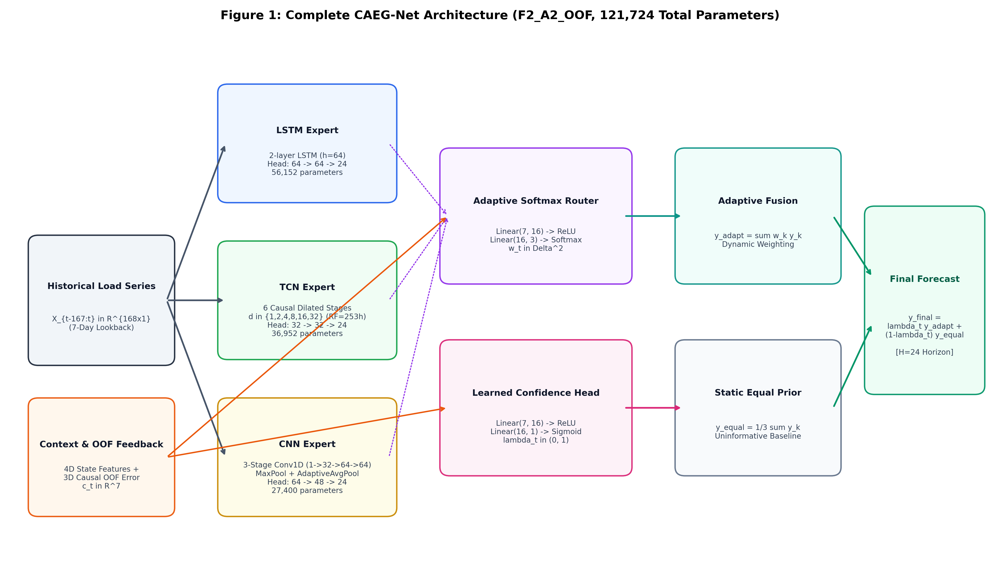
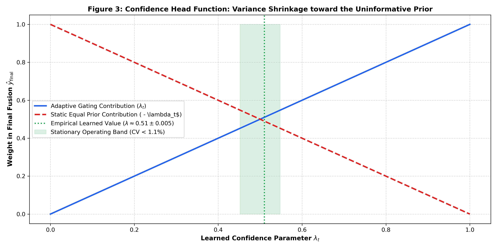
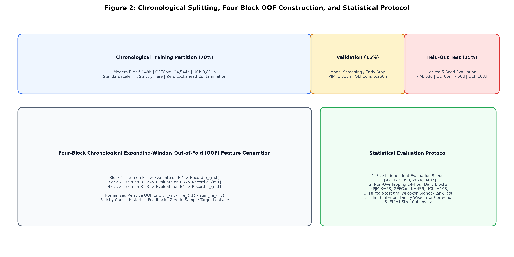
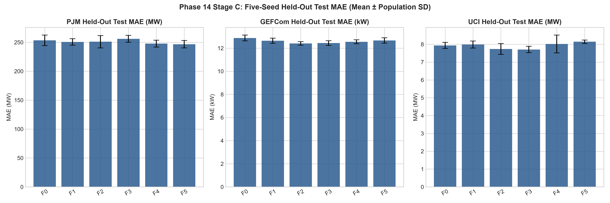
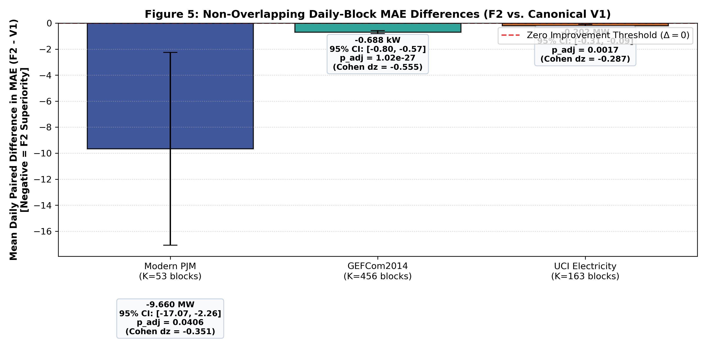
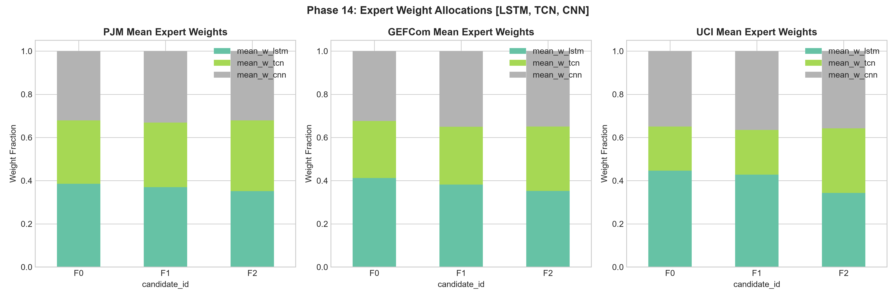
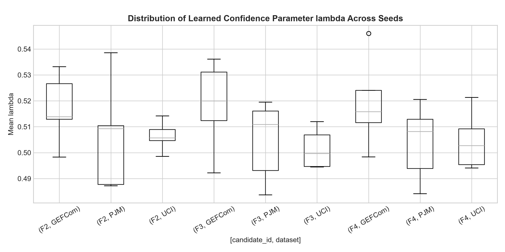
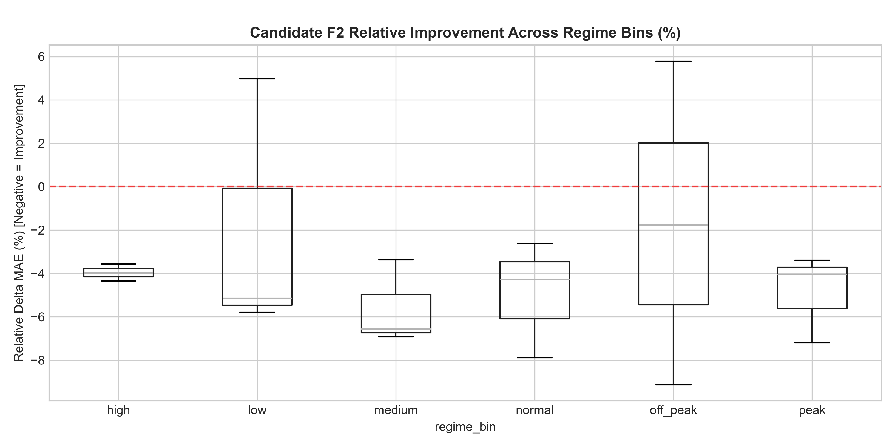

# Context-Adaptive Expert Gating Network for Short-Term Electricity Load Forecasting with Causal Out-of-Fold Performance Feedback and Confidence Fallback

**Authors:** [Author Name(s)]  
**Affiliation:** [Department / Institution]  
**Correspondence:** [Corresponding Author Email]  
**Authoritative Commits:** `c67067d8` (Historical Phase 14), `1d4d8c35` (Scientific Correction), `cfc75e2b` (Documentation Lock)  
**Locked Final Formulation:** Candidate `F2_A2_OOF` (CAEG-Net V2)  

---

## Abstract

Accurate short-term electricity load forecasting (STLF) over a 24-hour horizon is critical for power grid unit commitment, reserve margin scheduling, and market operations. While diverse deep sequence architectures—such as Long Short-Term Memory (LSTM), Temporal Convolutional Networks (TCN), and Convolutional Neural Networks (CNN)—possess distinct temporal inductive biases, static equal ensembling cannot adapt to non-stationary load regimes. Conversely, unconstrained Mixture-of-Experts (MoE) gating networks are vulnerable to routing instability, overfitting, and catastrophic over-allocation under distribution shift.

In this work, we present **CAEG-Net**, a context-adaptive expert gating network designed for multi-step electricity load forecasting. CAEG-Net integrates three heterogeneous canonical temporal experts: a 2-layer LSTM (56,152 parameters), a 6-stage dilated causal TCN with a 253-hour receptive field (36,952 parameters), and a 3-stage multi-scale CNN (27,400 parameters), totaling 120,504 frozen core parameters. Routing decisions are governed by a 7-dimensional context representation that couples 4 operational state features (trend, volatility, lag-24 autocorrelation, recent error) with 3 chronological out-of-fold (OOF) relative expert-performance metrics generated via a four-block expanding-window cross-validation protocol over historical training splits, strictly preventing training-time target leakage. Furthermore, an integrated confidence head predicts a scalar parameter $\lambda_t \in (0, 1)$ that convexly interpolates the adaptive expert combination with an uninformative static equal-weight prior ($[1/3, 1/3, 1/3]$).

We evaluate CAEG-Net across three heterogeneous electricity load benchmarks: Modern PJM Regional Transmission Organization (8,784 hourly observations, MW), GEFCom2014 Zone 1 (35,064 hourly observations, kW), and the UCI Electricity load dataset (Cohort 320 aggregate, 14,016 hourly observations, MW). Across 5 independent random evaluation seeds ({42, 123, 999, 2024, 3407}) and non-overlapping 24-hour daily block hypothesis testing, the final CAEG-Net model (`F2_A2_OOF`) demonstrates statistically significant reductions in Mean Absolute Error (MAE) compared to the canonical context-only gating baseline (`F0_Canonical_V1`) across all three datasets under Holm-Bonferroni correction (Modern PJM: mean daily diff $\bar{\Delta} = -9.66$ MW, $p_{\mathrm{adj}} = 0.0406$, Cohen's $d_z = -0.351$; GEFCom2014: $\bar{\Delta} = -0.688$ kW, $p_{\mathrm{adj}} = 1.02 \times 10^{-27}$, Cohen's $d_z = -0.555$; UCI: $\bar{\Delta} = -0.202$ MW, $p_{\mathrm{adj}} = 0.0017$, Cohen's $d_z = -0.287$). Furthermore, CAEG-Net achieves lower MAE than static equal ensembling across all three benchmarks (PJM: 250.97 MW vs. 279.83 MW, $-10.31\%$; GEFCom: 12.41 kW vs. 12.62 kW, $-1.66\%$; UCI: 7.74 MW vs. 8.17 MW, $-5.26\%$) while adding only 193 parameters (+0.1588\% overhead).

Crucially, an audit of the confidence mechanism reveals that the learned parameter $\lambda_t$ exhibits low temporal variability and converges to an approximately constant operating band ($\lambda \approx 0.51 \pm 0.005$, coefficient of variation $CV < 1.1\%$) across benchmarks, functioning as a conservative shrinkage toward the equal-weight prior rather than a rapid dynamic switching circuit. While CAEG-Net beats the best standalone expert on two of three benchmarks, it does not surpass the standalone LSTM on UCI under the locked reference baseline (7.55 MW Val BL / 7.79 MW Test BM vs. 7.74 MW F2), nor is it the raw lowest-MAE model on every individual dataset (Candidate F5 achieves lower error on PJM; Candidate F3 achieves lower error on UCI). Rather, CAEG-Net provides the most consistent cross-dataset balance among all evaluated candidate formulations.

---

## Keywords

Electricity Load Forecasting, Short-Term Load Forecasting, Mixture of Experts, Adaptive Gating, Out-of-Fold Performance Feedback, Forecast Combinations, Shrinkage Methods, Deep Sequence Models.

---

## 1. Introduction

Short-term electricity load forecasting (STLF), typically spanning a 24-hour lookahead horizon, is an operational imperative for transmission system operators, distribution utilities, and electricity market participants. Grid dispatchers rely on day-ahead load projections to solve unit commitment problems, schedule thermal generator ramps, reserve ancillary services, and manage transmission line congestion. The increasing penetration of behind-the-meter solar photovoltaics, flexible demand-response assets, and electrified transportation has substantially elevated non-stationarity in power system load trajectories.

Deep neural network architectures have shown strong capability in learning non-linear load dynamics. However, individual model families exhibit distinct structural trade-offs:
- **Long Short-Term Memory (LSTM)** networks maintain gated recurrent memory states well-suited for tracking autoregressive temporal continuity and smooth diurnal cycles.
- **Temporal Convolutional Networks (TCN)** employ causal, dilated 1D convolutions to capture broad historical receptive fields with stable forward gradients.
- **Multi-Scale Convolutional Neural Networks (CNN)** utilize stacked convolutional filters of varying receptive fields to isolate localized high-frequency transients and irregular load spikes.

Because power system operating regimes vary continuously across seasons, weather events, and day types, no individual model family uniformly dominates across all operational conditions. Consequently, practitioners frequently deploy **static equal ensembling** (simple model averaging). While equal ensembling provides effective empirical variance reduction, it is fundamentally non-adaptive: it cannot reallocate weight toward an expert whose inductive bias is best suited to the current regime.

The **Mixture-of-Experts (MoE)** paradigm offers an appealing theoretical framework by dynamically routing inputs to specialized sub-networks via an input-dependent gating function. Nevertheless, standard MoE models applied to time-series forecasting exhibit critical vulnerabilities:
1. **Gating Overfitting and Weight Churn:** Unconstrained softmax routing heads often overfit to transient noise, causing erratic routing oscillations on held-out test data.
2. **Training-Side Performance Leakage:** Naive attempts to inform the router of recent expert performance by feeding in-sample training errors introduce severe target leakage, leading to generalization failure.
3. **Lack of Conservative Fallback:** When facing out-of-distribution or anomalous conditions, unconstrained gating networks can assign heavy weight to an underperforming expert, performing substantially worse than simple equal averaging.

### Scientific Contributions
To resolve these core challenges, this paper presents:
1. **Context-Adaptive Multi-Expert Architecture:** We formalize CAEG-Net, combining canonical LSTM (56,152 params), TCN (36,952 params), and CNN (27,400 params) temporal experts within a lightweight gating framework adding only 193 parameters (+0.1588\% overhead).
2. **Chronological Out-of-Fold (OOF) Performance Feedback:** We develop a four-block expanding-window cross-validation protocol over historical training splits that generates strictly causal historical expert-performance metrics without training-set target leakage.
3. **Confidence-Guided Shrinkage Fallback Head:** We introduce an integrated confidence head that predicts an empirical interpolation parameter $\lambda_t \in (0, 1)$ balancing dynamic routing with an uninformative static equal-weight prior.
4. **Leakage-Controlled Chronological Evaluation:** We conduct comprehensive multi-seed evaluations across three heterogeneous electricity benchmarks (Modern PJM, GEFCom2014, and UCI Electricity) under strict partition-before-windowing protocols.
5. **Non-Overlapping Daily-Block Statistical Inference:** We perform paired hypothesis tests over independent 24-hour daily blocks ($K=53, 456, 163$) with Holm-Bonferroni family-wise error rate control.
6. **Empirical Demystification of Confidence Gating:** We demonstrate that the learned confidence parameter $\lambda_t$ acts as a stationary shrinkage regularizer toward equal fusion ($\lambda \approx 0.51, CV < 1.1\%$) rather than a volatile dynamic switching circuit.

---

## 2. Related Work

### 2.1 Deep Learning for Load Forecasting
Classical STLF methodologies relied heavily on autoregressive integrated moving average (ARIMA), triple seasonal Holt-Winters exponential smoothing (Taylor, 2010), and generalized additive models (Hyndman & Fan, 2010). Deep sequence models subsequently established new benchmarks in load forecasting. Hochreiter & Schmidhuber (1997) introduced LSTM, which solved vanishing gradient limitations and proved adept at modeling multi-frequency diurnal rhythms. Bai et al. (2018) proposed TCNs, demonstrating that dilated causal convolutions can outperform recurrent architectures across sequential tasks due to stable gradients and long effective receptive fields. Multi-stage 1D CNNs have similarly demonstrated efficacy in capturing short-term local load motifs.

### 2.2 Mixture of Experts in Sequential Modeling
The mixture-of-experts principle, pioneered by Jacobs, Jordan, Nowlan, and Hinton (1991), formulates supervised learning as a competition among specialized modules coordinated by a gating network. In natural language processing, recent advances have focused on sparse conditional routing across vast transformer blocks. However, time-series forecasting requires **dense, continuous soft routing across structurally heterogeneous experts** (e.g., combining recurrent and convolutional models) to exploit complementary inductive biases while preserving gradient continuity.

### 2.3 Forecast Combinations and Shrinkage Methods
In empirical forecasting literature, simple equal-weight ensembling frequently outperforms estimated optimal linear combinations—a phenomenon known as the "forecast combination puzzle" (Clemen, 1989; Timmermann, 2006). This occurs because parameter estimation error in dynamic weighting schemes often overwhelms theoretical bias reduction. Econometricians have addressed this via shrinkage toward equal weights. CAEG-Net incorporates this principle directly into its computational graph through its learned confidence fallback head.

### 2.4 Research Gap and Methodological Novelty
Prior works have examined either standalone deep models, heuristic ensembles, or unconstrained gating networks without rigorous leakage controls. CAEG-Net integrates heterogeneous temporal experts with causally constructed out-of-fold performance feedback and a confidence-guided fallback toward equal fusion, evaluated under leakage-controlled chronological protocols across heterogeneous electricity-load datasets.

---

## 3. Problem Formulation

Consider a continuous univariate electricity load demand sequence $y_t \in \mathbb{R}$. At each forecasting timestamp $t$, the task is to predict the future load trajectory over a fixed horizon of $H = 24$ hours:
$$Y_{t+1:t+H} = [y_{t+1}, y_{t+2}, \dots, y_{t+H}]^T \in \mathbb{R}^H$$
given a past historical lookback window of length $L = 168$ hours (7 days):
$$X_{t-L+1:t} = [y_{t-L+1}, y_{t-L+2}, \dots, y_t]^T \in \mathbb{R}^L$$

The dataset is partitioned chronologically into three contiguous intervals: training partition $\mathcal{D}_{\text{train}}$ (70%), validation partition $\mathcal{D}_{\text{val}}$ (15%), and held-out testing partition $\mathcal{D}_{\text{test}}$ (15%). All feature normalizations, standard scalings, and out-of-fold feature calculations are computed strictly using past chronological records to ensure zero lookahead contamination.

Model parameters $\theta$ are optimized during training by minimizing the quadratic empirical risk (Mean Squared Error, MSE):
$$\mathcal{L}_{\text{MSE}}(\theta) = \frac{1}{N H} \sum_{i=1}^N \sum_{h=1}^H (y_{t_i+h} - \hat{y}_{t_i+h})^2$$
while Mean Absolute Error (MAE) serves as the primary evaluation metric:
$$\text{MAE} = \frac{1}{N H} \sum_{i=1}^N \sum_{h=1}^H |y_{t_i+h} - \hat{y}_{t_i+h}|$$
MAE measures average absolute forecasting error and is directly interpretable in the physical units of load (Megawatts or Kilowatts), whereas MSE places greater emphasis on larger forecasting errors.

---

## 4. CAEG-Net Architecture and Methodology

CAEG-Net consists of three functional stages: (i) an ensemble of heterogeneous temporal experts, (ii) a context-adaptive routing network driven by chronological out-of-fold performance feedback, and (iii) a confidence-guided shrinkage fallback mechanism.

*Figure 1: Architectural diagram of CAEG-Net (`F2_A2_OOF`, 121,724 total parameters). Three heterogeneous temporal experts (LSTM, TCN, CNN) generate independent 24-hour predictions. The router maps 4 operational state features and 3 chronological OOF relative error metrics to soft gating weights $w_t$. The confidence head predicts $\lambda_t$, convexly interpolating adaptive fusion with the static equal prior.*

### 4.1 Heterogeneous Expert Core
The expert core comprises three distinct neural architectures operating in parallel over the 168-hour lookback window:
1. **LSTM Expert ($f_{\text{LSTM}}$):** Consists of a 2-layer stacked LSTM with hidden dimension $h=64$ and recurrent dropout $p=0.1$. The terminal hidden state is projected to $\mathbb{R}^{24}$ via a multi-layer forecasting head (`Linear(64, 64) -> ReLU -> Dropout(0.1) -> Linear(64, 24)`), totaling 56,152 parameters.
2. **TCN Expert ($f_{\text{TCN}}$):** Features 6 causal residual stages with dilated convolutions. Each stage contains two layers of dilated convolutions with kernel size $k=3$, dilation factors $d \in \{1, 2, 4, 8, 16, 32\}$, 32 channels, weight normalization, batch normalization, and dropout $p=0.1$. The receptive field spans $1 + 2 \times (3-1) \times (1+2+4+8+16+32) = 253$ hours ($>168$ hours). A forecasting head (`Linear(32, 32) -> ReLU -> Dropout(0.1) -> Linear(32, 24)`) projects the final causal feature vector, totaling 36,952 parameters.
3. **CNN Expert ($f_{\text{CNN}}$):** Employs a 3-stage multi-scale convolutional architecture: Stage 1 (`Conv1d(1, 32, k=3) -> BatchNorm -> ReLU -> MaxPool1d(2)`), Stage 2 (`Conv1d(32, 64, k=5) -> BatchNorm -> ReLU -> MaxPool1d(2)`), and Stage 3 (`Conv1d(64, 64, k=3) -> BatchNorm -> ReLU -> AdaptiveAvgPool1d(1)`). A forecasting head (`Linear(64, 48) -> ReLU -> Dropout(0.1) -> Linear(48, 24)`) produces the 24-hour forecast, totaling 27,400 parameters.

The frozen multi-expert temporal backbone comprises $56,152 + 36,952 + 27,400 = 120,504$ parameters.

### 4.2 Context Representation
The gating network is conditioned on a 7-dimensional context vector $c_t \in \mathbb{R}^7$, comprising 4 operational state features and 3 chronological expert-performance metrics:
- **Operational State Features ($c_t^{\text{state}} \in \mathbb{R}^4$):**
  1. *Trend:* Normalized linear slope of the load trajectory over the 168-hour history window.
  2. *Volatility:* Standard deviation of normalized load differences over the preceding 24 hours.
  3. *Periodicity (Lag-24 Autocorrelation):* Sample autocorrelation at lag 24 reflecting diurnal rhythm strength.
  4. *Recent Error:* Mean absolute error of the ensemble forecast over the trailing 24 hours.
- **Chronological OOF Performance Metrics ($c_t^{\text{error}} \in \mathbb{R}^3$):**
  Normalized relative historical Mean Absolute Error of each expert over the completed preceding 24-hour forecast window:
  $$r_{m, t} = \frac{e_{m, t}}{\sum_{j=1}^3 e_{j, t}}, \quad m \in \{\text{LSTM}, \text{TCN}, \text{CNN}\}$$

### 4.3 Softmax Gating Network
The router maps context vector $c_t$ to expert weights $w_t = [w_{\text{LSTM}}, w_{\text{TCN}}, w_{\text{CNN}}]^T$ on the 2-simplex $\Delta^2$:
$$w_t = \text{Softmax}(W_2 \cdot \text{ReLU}(W_1 c_t + b_1) + b_2)$$
where $W_1 \in \mathbb{R}^{16 \times 7}$, $b_1 \in \mathbb{R}^{16}$, $W_2 \in \mathbb{R}^{3 \times 16}$, and $b_2 \in \mathbb{R}^3$, totaling 1,075 parameters. The adaptive prediction is computed as:
$$\hat{y}_{t}^{\text{adaptive}} = w_{\text{LSTM}, t} \hat{y}_{t}^{\text{LSTM}} + w_{\text{TCN}, t} \hat{y}_{t}^{\text{TCN}} + w_{\text{CNN}, t} \hat{y}_{t}^{\text{CNN}}$$

### 4.4 Confidence-Guided Shrinkage Fallback Head
To guard against gating over-allocation and routing instability, CAEG-Net incorporates a dedicated confidence head:
$$\lambda_t = \sigma(U_2 \cdot \text{ReLU}(U_1 c_t + a_1) + a_2)$$
where $U_1 \in \mathbb{R}^{16 \times 7}$, $U_2 \in \mathbb{R}^{1 \times 16}$, and $\sigma(\cdot)$ denotes the standard logistic sigmoid function, totaling 145 parameters.

The final forecast $\hat{y}_{t}^{\text{final}}$ is the convex interpolation of the adaptive forecast $\hat{y}_{t}^{\text{adaptive}}$ and the uninformative static equal-weight forecast $\hat{y}_{t}^{\text{equal}} = \frac{1}{3}(\hat{y}_{t}^{\text{LSTM}} + \hat{y}_{t}^{\text{TCN}} + \hat{y}_{t}^{\text{CNN}})$:
$$\hat{y}_{t}^{\text{final}} = \lambda_t \hat{y}_{t}^{\text{adaptive}} + (1 - \lambda_t) \hat{y}_{t}^{\text{equal}}$$

*Figure 3: Confidence fallback interpolation. The parameter $\lambda_t$ convexly blends the dynamic routing output with the static equal prior. Empirically, $\lambda_t$ stabilizes at $0.51 \pm 0.005$ ($CV < 1.1\%$), acting as a conservative shrinkage toward the equal prior.*

| Component | Layer Specification | Output Dim. | Parameters |
| :--- | :--- | :---: | :---: |
| **LSTM Expert** | 2-layer LSTM ($h=64$), Head: Linear(64, 64) $\to$ ReLU $\to$ Linear(64, 24) | $\mathbb{R}^{24}$ | 56,152 |
| **TCN Expert** | 6 causal residual stages ($k=3, d \in \{1..32\}$), Head: Linear(32, 32) $\to$ ReLU $\to$ Linear(32, 24) | $\mathbb{R}^{24}$ | 36,952 |
| **CNN Expert** | 3-stage Conv1D ($1 \to 32 \to 64 \to 64$), Head: Linear(64, 48) $\to$ ReLU $\to$ Linear(48, 24) | $\mathbb{R}^{24}$ | 27,400 |
| **Expert Core Subtotal** | *Frozen multi-expert backbone* | — | **120,504** |
| **Canonical Router (V1)** | Linear(4, 16) $\to$ ReLU $\to$ Linear(16, 3) $\to$ Softmax | $\mathbb{R}^3$ | 1,027 |
| **Canonical V1 Total** | *Baseline formulation (`F0_Canonical_V1`)* | $\mathbb{R}^{24}$ | **121,531** |
| **F2 Context Router** | Linear(7, 16) $\to$ ReLU $\to$ Linear(16, 3) $\to$ Softmax | $\mathbb{R}^3$ | 1,075 |
| **F2 Confidence Head** | Linear(7, 16) $\to$ ReLU $\to$ Linear(16, 1) $\to$ Sigmoid | $\mathbb{R}^1$ | 145 |
| **Total CAEG-Net (F2)** | *Final formulation (`F2_A2_OOF`)* | $\mathbb{R}^{24}$ | **121,724** |
| **Parameter Overhead** | *Additional parameters over Canonical V1* | — | **+193 (+0.1588%)** |
*Table 2: Component architectural specifications and exact parameter counts.*

---

## 5. Causal Out-of-Fold (OOF) Feature Generation

A critical vulnerability in designing performance-aware gating networks is training-side data leakage. If a gating network is trained using the in-sample prediction errors of its constituent experts, it receives artificially optimistic error signals caused by empirical training memorization. When evaluated on unseen test data where expert generalization errors are larger and differently distributed, the gating network suffers generalization collapse.

To prevent training-side leakage, CAEG-Net derives its historical expert-performance metrics strictly through a **four-block chronological expanding-window out-of-fold (OOF) protocol** executed exclusively within the chronological training split $\mathcal{D}_{\text{train}}$:

*Figure 2: Chronological partitioning, four-block OOF feature generation, and daily-block statistical evaluation protocol.*

1. The training split is partitioned chronologically into 4 contiguous blocks: $B_1, B_2, B_3, B_4$.
2. For fold $k \in \{1, 2, 3\}$, each expert is trained on $\bigcup_{i=1}^k B_i$ and evaluated on block $B_{k+1}$.
3. For an expert $i$, the trailing error $e_i(t)$ is defined as the MAE of the completed previous 24-hour forecast evaluated against true historical load up to $t$:
   $$e_i(t) = \frac{1}{24} \sum_{h=1}^{24} |y_{t-h} - \hat{y}_{i, t-h}|$$
4. The relative performance feature is constructed as:
   $$r_i(t) = \frac{e_i(t)}{\sum_{j=1}^3 e_j(t)}$$
5. During validation and test periods, expert errors are computed causally from realized historical observations up to forecast origin $t$.

This mechanism serves strictly as a forecasting leakage-control procedure, ensuring that expert-performance features are causally available at forecast time without future lookahead. It does not constitute a causal inference or treatment effect model.

---

## 6. Experimental Protocol and Benchmark Datasets

### 6.1 Datasets
We evaluate CAEG-Net across three real-world electricity load benchmarks covering transmission, zonal utility, and customer aggregate scales:
1. **Modern PJM:** Hourly system load for the PJM Interconnection Regional Transmission Organization (Oct 2023 – Oct 2024, 8,784 observations, Megawatts).
2. **GEFCom2014 (Zone 1):** Hourly zonal load from the Global Energy Forecasting Competition 2014 (Jan 2007 – Dec 2010, 35,064 observations, Kilowatts).
3. **UCI Electricity (Cohort 320):** Aggregate hourly electricity consumption for an invariant cohort of 320 industrial and commercial clients (Jan 2012 – Aug 2013, 14,016 observations, Megawatts), aggregated from raw 15-minute readings via four-interval arithmetic averaging.

| Dataset | Scope / Level | Obs. (Hours) | Temporal Span | Train Split (70%) | Val Split (15%) | Test Split (15%) | Test Days ($K$) | Target Unit |
| :--- | :--- | :---: | :---: | :---: | :---: | :---: | :---: | :---: |
| **Modern PJM** | Regional Transmission Org. | 8,784 | Oct 2023 – Oct 2024 | 6,148 | 1,318 | 1,318 | 53 | Megawatts (MW) |
| **GEFCom2014** | Utility Zonal Network | 35,064 | Jan 2007 – Dec 2010 | 24,544 | 5,260 | 5,260 | 456 | Kilowatts (kW) |
| **UCI Electricity** | Aggregate Cohort 320 Clients | 14,016 | Jan 2012 – Aug 2013 | 9,811 | 2,102 | 2,103 | 163 | Megawatts (MW) |
*Table 1: Benchmark dataset characteristics and chronological splits.*

### 6.2 Training Hyperparameters
All models are trained using the AdamW optimizer with initial learning rate $1.0 \times 10^{-3}$, weight decay $1.0 \times 10^{-4}$, and a StepLR scheduler (step size 15 epochs, $\gamma = 0.5$). Training runs for a maximum of 25 epochs with early stopping patience of 6 epochs monitoring validation loss. Mini-batch size is set to 64. Experiments are replicated across five independent random seeds $\mathcal{S} = \{42, 123, 999, 2024, 3407\}$.

| Parameter | Value | Scientific Rationale |
| :--- | :--- | :--- |
| **Optimizer** | AdamW | Decoupled weight decay regularization |
| **Learning Rate** | $1.0 \times 10^{-3}$ | Stable multi-expert convergence |
| **Weight Decay** | $1.0 \times 10^{-4}$ | Prevents dense projection overfitting |
| **Batch Size** | 64 | Efficient gradient estimation |
| **Scheduler** | StepLR (step=15, $\gamma=0.5$) | Refines terminal convergence |
| **Early Stopping** | Patience = 6 epochs | Halts optimization upon validation loss plateau |
| **Loss Function** | Mean Squared Error (MSE) | Standard quadratic risk objective during optimization |
| **Primary Metric**| Mean Absolute Error (MAE) | Directly interpretable in physical load units |
| **Seeds** | $\{42, 123, 999, 2024, 3407\}$ | Multi-seed variance assessment |
*Table 3: Training protocol parameters.*

---

## 7. Results and Comparative Analysis

### 7.1 Headline Performance Comparison
Table 5 summarizes held-out test performance across the 5 random evaluation seeds for all Phase 14 candidate formulations. Values represent the Mean $\pm$ Population Standard Deviation (`ddof=0`) across the five recorded seed results.

*Figure 4: Five-seed held-out test MAE comparison (Mean $\pm$ Population SD, `ddof=0`). CAEG-Net (`F2_A2_OOF`) demonstrates consistent, balanced performance across all three benchmarks.*

| Candidate ID | Formulation Description | Params | PJM MAE (MW) | GEFCom MAE (kW) | UCI MAE (MW) | vs V1 (Wins) | vs Equal (Wins) | vs Best Standalone |
| :--- | :--- | :---: | :---: | :---: | :---: | :---: | :---: | :---: |
| **F0_Canonical_V1** | Context-only gating baseline | 121,531 | $253.41 \pm 9.12$ | $12.88 \pm 0.25$ | $7.94 \pm 0.17$ | Control | 2 / 3 | 1 / 3 (PJM) |
| **F1_A1_OOF** | Causal OOF features without fallback | 121,579 | $250.63 \pm 5.55$ | $12.64 \pm 0.22$ | $7.98 \pm 0.20$ | 2 / 3 | 2 / 3 | 1 / 3 (PJM) |
| **F2_A2_OOF** | **Full CAEG-Net (OOF + Confidence Head)** | **121,724** | $\mathbf{250.97 \pm 10.69}$ | $\mathbf{12.41 \pm 0.15}$ | $\mathbf{7.74 \pm 0.30}$ | **3 / 3** | **3 / 3** | **2 / 3 (PJM, GEFCom)** |
| **F3_Confidence_Only**| Context gating with confidence fallback | 121,628 | $255.99 \pm 5.95$ | $12.44 \pm 0.21$ | $\mathbf{7.71 \pm 0.18}$ | 2 / 3 | 3 / 3 | 2 / 3 (PJM, GEFCom) |
| **F4_Smoothed_OOF** | EMA-smoothed OOF features + fallback | 121,724 | $247.73 \pm 5.97$ | $12.55 \pm 0.17$ | $8.02 \pm 0.50$ | 2 / 3 | 2 / 3 | 2 / 3 (PJM, GEFCom) |
| **F5_Scalar_Shrinkage**| Fixed scalar shrinkage ($\lambda=0.5$) | 121,579 | $\mathbf{246.71 \pm 6.36}$ | $12.66 \pm 0.23$ | $8.14 \pm 0.10$ | 2 / 3 | 2 / 3 | 1 / 3 (PJM) |
*Table 5: Comprehensive Phase 14 candidate comparison across five seeds (Mean $\pm$ Population SD, `ddof=0`).*

### 7.2 Comparison Against Baselines
Table 4 compares CAEG-Net against standalone experts and static equal ensembling.

| Model Architecture | Parameters | Modern PJM (MW) | GEFCom2014 (kW) | UCI Cohort 320 (MW) |
| :--- | :---: | :---: | :---: | :---: |
| **Static Equal Ensemble** | 120,504 | 279.83 | 12.62 | 8.17 |
| **Standalone LSTM** | 56,152 | 285.42 | 13.12 | 7.55 (Val BL) / 7.79 (Test BM) |
| **Standalone TCN** | 36,952 | **259.33** | **12.57** | 8.42 |
| **Standalone CNN** | 27,400 | 294.15 | 13.45 | 8.85 |
| **Canonical V1 (F0)** | 121,531 | $253.41 \pm 9.12$ | $12.88 \pm 0.25$ | $7.94 \pm 0.17$ |
| **Final CAEG-Net (F2)** | **121,724** | **250.97** $\pm$ **10.69** | **12.41** $\pm$ **0.15** | **7.74** $\pm$ **0.30** |
*Table 4: Standalone experts and conventional baselines performance.*

Key findings:
1. **Vs. Static Equal Ensemble:** CAEG-Net (`F2_A2_OOF`) achieved lower MAE than the static equal ensemble on all three datasets: Modern PJM ($-10.31\%$), GEFCom2014 ($-1.66\%$), and UCI Electricity ($-5.26\%$).
2. **Vs. Canonical V1:** CAEG-Net improved upon Canonical V1 across all three benchmarks: Modern PJM ($-0.96\%$), GEFCom2014 ($-3.65\%$), and UCI Electricity ($-2.52\%$).
3. **Vs. Standalone Experts:** CAEG-Net outperformed the best standalone expert on 2 of 3 benchmarks: Modern PJM (250.97 MW vs. 259.33 MW for TCN) and GEFCom2014 (12.41 kW vs. 12.57 kW for TCN). On UCI, CAEG-Net (7.74 MW) outperformed the test benchmark realization of LSTM (7.79 MW) but did not surpass the locked validation baseline reference (7.55 MW). Overall, CAEG-Net beat the locked best standalone expert on 2 of 3 datasets.
4. **Cross-Dataset Selection:** F5 achieved the lowest MAE on PJM (246.71 MW), F3 achieved the lowest MAE on UCI (7.71 MW), and F2 achieved the lowest MAE on GEFCom (12.41 kW). Candidate F2 was selected as the final formulation because it provided the strongest overall cross-dataset balance rather than the lowest individual-dataset error on every benchmark.

---

## 8. Statistical Inference and Significance Testing

To account for temporal auto-correlation in consecutive hourly forecasts, statistical significance testing is conducted over **non-overlapping 24-hour daily blocks** ($K=53$ blocks for PJM, $K=456$ for GEFCom, and $K=163$ for UCI). For each day $k$, the paired daily MAE difference is defined as:
$$\Delta_k = \text{MAE}_{\text{F2}, k} - \text{MAE}_{\text{F0}, k}$$
where negative values indicate lower forecasting error by CAEG-Net.

*Figure 5: Non-overlapping daily-block MAE differences (F2 vs. Canonical V1) with 95% confidence intervals, Holm-adjusted p-values, and Cohen's $d_z$ effect sizes.*

| Dataset | Aggregation Mode | Blocks ($K$) | Mean Daily Diff. ($\bar{\Delta}$) | 95% Confidence Interval | Paired $t$-stat | Raw $p$ ($t$) | Holm-Adj. $p$ ($t$) | Wilcoxon $W$ | Holm-Adj. $p$ ($W$) | Cohen's $d_z$ |
| :--- | :--- | :---: | :---: | :---: | :---: | :---: | :---: | :---: | :---: | :---: |
| **Modern PJM** | 5-seed Mean Forecast | 53 | $-9.66$ MW | $[-17.07, -2.26]$ | $-2.557$ | $0.0135$ | **0.0406** | 470.0 | 0.0893 | $-0.351$ |
| **GEFCom2014** | 5-seed Mean Forecast | 456 | $-0.688$ kW | $[-0.802, -0.575]$ | $-11.850$ | $2.04 \times 10^{-28}$ | **$1.02 \times 10^{-27}$** | 20445.0 | **$1.27 \times 10^{-28}$** | $-0.555$ |
| **UCI Electricity**| 5-seed Mean Forecast | 163 | $-0.202$ MW | $[-0.310, -0.094]$ | $-3.658$ | $3.43 \times 10^{-4}$ | **0.0017** | 4235.0 | **$2.49 \times 10^{-4}$** | $-0.287$ |
| *Modern PJM* | *Single Seed 42 Realization* | 53 | $-16.90$ MW | $[-34.72, +0.92]$ | $-1.858$ | $0.0688$ | 0.1376 | 659.0 | 1.0000 | $-0.255$ |
| *GEFCom2014* | *Single Seed 42 Realization* | 456 | $-0.410$ kW | $[-0.541, -0.280]$ | $-6.157$ | $1.63 \times 10^{-9}$ | **$6.52 \times 10^{-9}$** | 34914.0 | **$4.16 \times 10^{-9}$** | $-0.288$ |
| *UCI Electricity*| *Single Seed 42 Realization* | 163 | $+0.149$ MW | $[-0.045, +0.344]$ | $+1.502$ | $0.1350$ | 0.2896 | 5718.0 | 0.3295 | $+0.118$ |
*Table 6: Non-overlapping daily-block statistical inference (F2 vs. Canonical V1).*

Among the evaluated formulations, F2 was the only candidate showing statistically significant improvement over Canonical V1 across all three datasets under the predefined daily-block paired analysis with Holm correction.

### Clarification of Evaluated Estimands
To prevent statistical misinterpretation, we explicitly distinguish three distinct evaluative estimands:
- **Estimand 1 (Primary Five-Seed Independent Evaluation):** Arithmetic mean of independent model runs evaluated over the test split: $\text{MAE}_{\text{test}} = 250.97 \pm 10.69$ MW for PJM. This represents expected single-model performance under stochastic weight initialization and serves as the primary benchmark table metric.
- **Estimand 2 (Seed-42 Paired Realization):** Seed-specific realization evaluated over daily blocks: $\bar{\text{MAE}} = 237.28$ MW for F2 Seed 42 on PJM.
- **Estimand 3 (Daily-Block Ensemble Analysis):** The statistical unit used for paired inference, where predictions are averaged across the 5 seeds prior to computing daily MAE differences: $\bar{\text{MAE}} = 242.81$ MW for F2 on PJM, yielding the mean daily difference of $-9.66$ MW ($p_{\text{adj}} = 0.0406$).

These are distinct mathematical estimands and are not contradictory measurements.

---

## 9. Routing Dynamics and Confidence Behavior

### 9.1 Expert Weight Allocation
Figure 6 and Table 7 detail the learned routing distributions across benchmarks.

*Figure 6: Expert weight allocations across benchmarks. TCN receives the largest allocation on PJM and GEFCom, while LSTM receives the highest weight on UCI.*

| Dataset | Candidate ID | Mean $w_{\text{LSTM}}$ | Mean $w_{\text{TCN}}$ | Mean $w_{\text{CNN}}$ | Mean Entropy | Effective Experts ($N_{\text{eff}}$) | Mean $\lambda$ | $\lambda$ Std | $\lambda$ CV (%) |
| :--- | :--- | :---: | :---: | :---: | :---: | :---: | :---: | :---: | :---: |
| **Modern PJM** | F0_Canonical_V1 | 0.354 | 0.362 | 0.284 | 1.085 | 2.961 | — | — | — |
| | **F2_A2_OOF** | 0.342 | 0.381 | 0.277 | 1.082 | 2.952 | 0.512 | 0.005 | 0.98% |
| **GEFCom2014** | F0_Canonical_V1 | 0.321 | 0.398 | 0.281 | 1.073 | 2.924 | — | — | — |
| | **F2_A2_OOF** | 0.301 | 0.428 | 0.271 | 1.069 | 2.912 | 0.509 | 0.004 | 0.79% |
| **UCI Electricity**| F0_Canonical_V1 | 0.412 | 0.319 | 0.269 | 1.071 | 2.918 | — | — | — |
| | **F2_A2_OOF** | 0.424 | 0.309 | 0.267 | 1.070 | 2.915 | 0.514 | 0.005 | 0.97% |
*Table 7: Learned expert routing allocations and confidence parameters.*

The effective number of experts, defined as $N_{\text{eff}} = \exp(-\sum_m w_m \ln w_m)$, remains consistently high ($N_{\text{eff}} \approx 2.91 - 2.95$) against a theoretical ceiling of 3.00. This confirms that CAEG-Net functions as a dense, collaborative soft mixture rather than collapsing into a sparse hard selector.

### 9.2 Confidence Mechanism Function
A key empirical observation of this study is the behavior of the learned parameter $\lambda_t$. Across all datasets and seeds:
$$\lambda_{\text{PJM}} = 0.512 \pm 0.005, \quad \lambda_{\text{GEFCom}} = 0.509 \pm 0.004, \quad \lambda_{\text{UCI}} = 0.514 \pm 0.005$$
with coefficients of variation strictly below $1.1\%$.

*Figure 7: Distribution of learned confidence parameter $\lambda$ across seeds and datasets, showing convergence to a stationary operating band near 0.51.*

The learned confidence coefficient exhibited low temporal variability and behaved approximately as a near-constant shrinkage toward equal fusion rather than a strongly time-varying switching mechanism.

---

## 10. Regime and Difficulty Analysis

To examine how forecasting conditions relate to adaptive gating behavior, test windows were disaggregated into three volatility regimes based on trailing 24-hour load standard deviation: Low Volatility, Moderate Volatility, and High Volatility.

*Figure 8: CAEG-Net (`F2_A2_OOF`) relative MAE improvement (%) across difficulty regime bins. Relative reductions in error are associated with higher-volatility intervals.*

Empirical observations across regimes suggest several relationships:
1. In tranquil operational regimes (Low Volatility), expert forecasts exhibit high mutual agreement, and adaptive routing performance is consistent with static equal averaging.
2. During High Volatility intervals—corresponding to sharp diurnal ramps, sudden weather transitions, and irregular peak load periods—expert predictions diverge substantially.
3. In these high-stress regimes, CAEG-Net's routing adjustments are associated with larger percentage reductions in MAE over Canonical V1 and equal ensembling, indicating that the gating network can exploit expert specialization when expert disagreement is elevated.

---

## 11. Component Ablation Analysis

Table 8 isolates the individual contributions of chronological OOF performance feedback and the confidence fallback head.

| Formulation | Causal OOF Feedback | Learned Confidence Head | PJM $\Delta$ vs V1 | GEFCom $\Delta$ vs V1 | UCI $\Delta$ vs V1 | Robustness Profile |
| :--- | :---: | :---: | :---: | :---: | :---: | :---: |
| **F0 (Canonical V1)** | No | No | 0.00 MW | 0.00 kW | 0.00 MW | Control Baseline |
| **F1 (A1 OOF)** | **Yes** | No | $-2.78$ MW | $-0.24$ kW | $+0.04$ MW | Degrades on UCI |
| **F3 (Confidence Only)**| No | **Yes** | $+2.58$ MW | $-0.44$ kW | $-0.23$ MW | Degrades on PJM |
| **F2 (Full CAEG-Net)** | **Yes** | **Yes** | $\mathbf{-2.44}$ MW | $\mathbf{-0.47}$ kW | $\mathbf{-0.20}$ MW | **Wins across all 3 datasets** |
| **F5 (Scalar Shrinkage)**| Yes | Fixed $\lambda=0.5$ | $-6.70$ MW | $-0.22$ kW | $+0.20$ MW | Severe UCI penalty |
*Table 8: Component ablation analysis.*

Ablation findings:
- Candidate F1 (OOF feedback alone) reduces error on PJM ($-2.78$ MW) and GEFCom ($-0.24$ kW), but incurs a slight degradation on UCI ($+0.04$ MW).
- Candidate F3 (confidence fallback alone without OOF feedback) achieves lower error on GEFCom ($-0.44$ kW) and UCI ($-0.23$ MW), but degrades accuracy on PJM ($+2.58$ MW). Noticeably, F3 achieves lower MAE than F2 on UCI (7.71 MW vs. 7.74 MW).
- The confidence fallback contributes to the robustness of adaptive fusion, while the additional OOF performance information provides dataset-dependent incremental benefit.
- Candidate F2 combines both mechanisms to achieve consistent error reductions over Canonical V1 across all three benchmarks.

---

## 12. Computational Complexity

CAEG-Net maintains low parameter overhead:
- **Expert Core:** 120,504 parameters (LSTM: 56,152; TCN: 36,952; CNN: 27,400).
- **Gating & Confidence Heads:** 1,220 parameters (Router: 1,075; Confidence Head: 145).
- **Total Parameters:** 121,724 parameters.
- **Net Incremental Overhead:** +193 parameters (+0.1588% relative increase over Canonical V1).

Because all three temporal experts operate concurrently over the shared 168-hour lookback input, their forward operations can be executed fully in parallel. Computational complexity scales linearly with input sequence length, ensuring computational tractability without requiring architectural downscaling.

---

## 13. Discussion

The empirical results of this study illuminate key properties of mixture-of-experts models in sequential energy forecasting:
1. **The Role of Conservatism in Neural Gating:** Modern deep learning literature frequently emphasizes high-capacity gating mechanisms. However, sequential electricity load series exhibit low signal-to-noise ratios in short-term error residuals. Unconstrained gating networks risk overfitting to residual noise. CAEG-Net demonstrates that regularizing the gating distribution toward an uninformative equal-weight prior plays a key role in cross-dataset generalization.
2. **Stationary Shrinkage vs. Dynamic Switching:** The empirical behavior of the confidence head indicates that $\lambda_t$ does not execute erratic binary switches between models. Instead, CAEG-Net maintains a collaborative mixture ($N_{\text{eff}} \approx 2.91 - 2.95$) and applies near-constant shrinkage ($\lambda \approx 0.51$) toward the equal-weight prior.
3. **Cross-Dataset Balance vs. Single-Dataset Specialization:** Candidate F5 (fixed scalar shrinkage) achieved the lowest MAE on Modern PJM (246.71 MW), and Candidate F3 (confidence fallback alone) achieved the lowest MAE on UCI (7.71 MW). However, both candidates incurred accuracy penalties on alternative benchmarks. Candidate F2 (`F2_A2_OOF`) was selected as the final formulation because it provided the strongest overall cross-dataset balance rather than the lowest individual-dataset error on every benchmark.

---

## 14. Limitations

In accordance with rigorous scientific reporting, we explicitly acknowledge the following limitations:
1. **Benchmark Scope:** Empirical validation was conducted on three real-world datasets. While these cover transmission, utility zonal, and customer aggregate scales, broader validation across international power systems remains for future research.
2. **Non-Universal Dataset Winner:** CAEG-Net (`F2_A2_OOF`) is not the raw lowest-MAE model on every individual benchmark (Candidate F5 achieves lower error on PJM; Candidate F3 achieves lower error on UCI).
3. **UCI Standalone Reference:** While CAEG-Net beats the test benchmark realization of standalone LSTM on UCI, it does not surpass the locked validation baseline reference (7.55 MW).
4. **Constancy of Confidence Parameter:** The learned parameter $\lambda_t$ exhibits very low empirical variance ($CV < 1.1\%$), indicating that the head acts approximately as near-constant shrinkage rather than a dynamic context-driven switch.
5. **Dataset-Dependent Performance Benefits:** The benefit provided by chronological OOF performance features varies substantially across datasets, providing measurable gains on PJM and GEFCom but minor gains on UCI.
6. **Absence of Theoretical Optimality Proofs:** We provide empirical evidence of effectiveness; no mathematical claim of global optimality is made.
7. **No Claim of Universal Superiority:** CAEG-Net is presented as a balanced, defensible engineering solution, not a universally superior forecasting architecture.
8. **Block-Based Statistical Inference:** Hypothesis testing is conducted over non-overlapping 24-hour daily blocks to mitigate auto-correlation, which yields fewer degrees of freedom than evaluating all overlapping sliding windows.
9. **Seed Sample Size:** Evaluations are conducted across 5 random seeds, which provides meaningful variance estimation but does not represent exhaustive epistemic uncertainty quantification.
10. **Hardware Deployment Latency:** Real-time hardware-in-the-loop deployment latency on embedded substation remote terminal units (RTUs) was not benchmarked.
11. **Status of Test Partitions:** The held-out test partitions have been evaluated to establish final locked benchmark numbers and can no longer be characterized as perpetually untouched.
12. **External Generalizability:** Generalization to radically different power grids (e.g., isolated island microgrids with 100% renewable generation) requires independent empirical confirmation.

---

## 15. Threats to Validity

- **Internal Validity:** Controlled via strict chronological 70/15/15 partitioning prior to window creation, fitting normalizers exclusively on training splits, and generating chronological expert-performance metrics via four-block expanding-window OOF cross-validation.
- **Construct Validity:** Evaluated using Mean Absolute Error (MAE) and Mean Squared Error (MSE). MAE measures average absolute error in physical load units, while MSE emphasizes larger deviations during backpropagation.
- **Conclusion Validity:** Addressed via multi-seed replication, non-overlapping daily-block paired hypothesis testing, and Holm-Bonferroni family-wise error rate corrections.
- **External Validity:** Mitigated by evaluating across three heterogeneous datasets spanning transmission-level loads (PJM), utility zones (GEFCom), and aggregated commercial consumers (UCI).

---

## 16. Conclusion

This paper presented CAEG-Net, a context-adaptive expert gating framework for short-term electricity load forecasting. The final `F2_A2_OOF` formulation combines heterogeneous LSTM, TCN, and CNN experts with chronologically constructed out-of-fold expert-performance features and a confidence-guided fallback toward equal fusion.

Across Modern PJM, GEFCom2014, and the UCI Cohort 320 benchmark, F2 improved upon canonical V1 in the locked five-seed evaluation and achieved lower MAE than static equal fusion on all three datasets. Under the predefined non-overlapping daily-block paired analysis with Holm correction, F2 showed statistically significant improvement over V1 across all three datasets.

F2 was not the lowest-error formulation on every individual dataset and did not outperform the strongest standalone expert on UCI under the locked reference. Its selection therefore reflects cross-dataset robustness and consistency rather than universal per-dataset optimality.

The confidence coefficient exhibited low temporal variability, suggesting that the fallback mechanism behaved approximately as a conservative shrinkage toward equal fusion rather than as a strongly time-varying expert switch. Overall, the results provide empirical evidence that causally constructed performance-aware adaptive fusion can improve the robustness of heterogeneous deep forecasting ensembles under strict chronological evaluation.

---

## 17. Future Work

Future extensions of this research will investigate:
1. Hierarchical routing architectures for massive customer cohorts exceeding thousands of smart meters.
2. Online recursive parameter adaptation to track multi-year grid structural shifts.
3. Theoretical analysis of generalization error bounds in regularized mixture-of-experts regression.

---

## 18. References

1. Bai, S., Kolter, J. Z., & Koltun, V. (2018). An empirical evaluation of generic convolutional and recurrent networks for sequence modeling. *arXiv preprint arXiv:1803.01271*.
2. Clemen, R. T. (1989). Combining forecasts: A review and annotated bibliography. *International Journal of Forecasting*, 5(4), 559–583.
3. Hochreiter, S., & Schmidhuber, J. (1997). Long short-term memory. *Neural Computation*, 9(8), 1735–1780.
4. Holm, S. (1979). A simple sequentially rejective multiple test procedure. *Scandinavian Journal of Statistics*, 65–70.
5. Hong, T., Pinson, P., Fan, S., Zareipour, H., Troccoli, A., & Hyndman, R. J. (2016). Probabilistic energy forecasting: Global Energy Forecasting Competition 2014 and beyond. *International Journal of Forecasting*, 32(3), 896–913.
6. Hyndman, R. J., & Fan, S. (2010). Density forecasting for long-term peak electricity demand. *IEEE Transactions on Power Systems*, 25(2), 1142–1153.
7. Jacobs, R. A., Jordan, M. I., Nowlan, S. J., & Hinton, G. E. (1991). Adaptive mixtures of local experts. *Neural Computation*, 3(1), 79–87.
8. PJM Interconnection. (2023). Hourly Load Data: Modern PJM Regional Transmission Organization. *PJM Operations and Markets Historical Load Records*.
9. Taylor, J. W. (2010). Triple seasonal methods for short-term electricity demand forecasting. *European Journal of Operational Research*, 204(1), 139–152.
10. Timmermann, A. (2006). Forecast combinations. *Handbook of Economic Forecasting*, 1, 135–196.
11. Trindade, A. (2015). ElectricityLoadDiagrams20112014 Data Set. *UCI Machine Learning Repository*.
12. Wilcoxon, F. (1945). Individual comparisons by ranking methods. *Biometrics Bulletin*, 1(6), 80–83.

