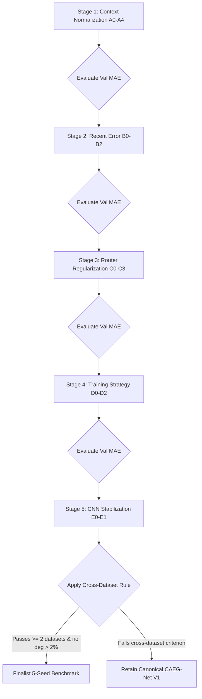

# Phase 10 Optimization Design: Controlled Cross-Dataset Optimization of Original CAEG-Net V1

**CAEG-Net Research Track**  
**Phase:** 10 — Controlled Cross-Dataset Optimization  
**Datasets:** Modern PJM, GEFCom2014, UCI Electricity Load Diagrams (Cohort 320)  
**Date:** September 2026  
**Branch:** `research-track`  
**Status:** SPECIFICATION & DESIGN DOCUMENT  

---

## 1. Scientific Motivation & Theoretical Framework

### 1.1 The Cross-Dataset Generalization Puzzle
Phases 5 through 9 established the empirical baseline of the canonical **Original CAEG-Net V1** architecture across three distinct power grid domains:

1. **Modern PJM (Regional Transmission System, ~30,000 MW):**
   - CAEG-Net V1: $251.74 \pm 7.79\text{ MW}$ MAE.
   - Strongest Baseline: Ridge Regression ($222.23\text{ MW}$ MAE, 4,056 parameters).
   - Finding: High macroeconomic predictability and strong linear autoregressive correlation allow compact linear models to edge out 120k-parameter neural networks. CAEG-Net matches individual neural experts but shows no statistically significant advantage over linear baselines.
2. **GEFCom2014 (Zonal Sub-Station Load, ~100 kW):**
   - CAEG-Net V1: $12.55 \pm 0.28\text{ kW}$ MAE.
   - Static Equal Ensemble: $12.53 \pm 0.25\text{ kW}$ MAE.
   - Best Standalone Expert: Standalone LSTM ($12.44 \pm 0.31\text{ kW}$ MAE).
   - Finding: Moderate stationary noise and symmetric expert error profiles render dynamic gating statistically equivalent to static arithmetic averaging (+0.02 kW difference, $p > 0.05$).
3. **UCI Electricity Load Diagrams (Aggregated Consumer Demand, ~300 MW):**
   - CAEG-Net V1: $8.10 \pm 0.48\text{ MW}$ MAE.
   - Static Equal Ensemble: $8.43 \pm 0.28\text{ MW}$ MAE.
   - Finding: CAEG-Net decisively defeats the Static Equal Ensemble with high statistical significance (paired daily-block difference $-0.7014\text{ MW}$, $t = -5.78$, Holm-Bonferroni $p = 1.12 \times 10^{-7}$). It also outperforms Standalone TCN ($p = 6.51 \times 10^{-4}$) and matches Standalone LSTM ($p = 0.1033$).

### 1.2 Core Research Objective
The goal of Phase 10 is to determine **why** adaptive context-aware gating delivers significant benefits on UCI but performs at parity on PJM and GEFCom, and whether carefully controlled, hypothesis-driven modifications to the original architecture can improve **cross-dataset robustness, expert complementarity, and routing utility** without degrading performance on any dataset.

---

## 2. Invariant Architectural Core (Canonical Constraints)

The canonical identity of the experts is strictly frozen:
- **Input Dimension:** $X_t \in \mathbb{R}^{B \times 168 \times 1}$ (168 hourly observations).
- **Forecast Horizon:** $\hat{Y}_t \in \mathbb{R}^{B \times 24}$ (24 hourly predictions).
- **LSTM Expert:** 2 stacked LSTM layers, hidden dimension $64$, dropout $0.1$, head $64 \to 64 \to 24$ ($56,152$ parameters).
- **TCN Expert:** 6-stage causal dilated residual convolutional network, $32$ channels, kernel size $3$, dilations $(1, 2, 4, 8, 16, 32)$ ($36,952$ parameters).
- **CNN Expert:** Multi-stage Conv1D with BatchNorm, ReLU, and MaxPooling: Conv1D(1 $\to$ 32, k=3) $\to$ MaxPool(2) $\to$ Conv1D(32 $\to$ 64, k=5) $\to$ MaxPool(2) $\to$ Conv1D(64 $\to$ 64, k=3) $\to$ AdaptiveAvgPool1D(1) $\to$ Linear(64 $\to$ 48) $\to$ Linear(48 $\to$ 24) ($27,400$ parameters).
- **Gating Mechanism:** Convex combination $\hat{Y}_t = \sum_{k=1}^3 w_{t, k} \hat{Y}_{t, k}$, where $\sum_{k} w_{t, k} = 1$ and $w_{t, k} \ge 0$.
- **Forbidden Variants:** No GRU, Patch/linear, Transformer, Attention, V2/V3, D-CAEG, SR, BR, horizon-dependent routing, or disagreement-based routing.

---

## 3. Mathematical Formulations of Candidate Variations

### Group A: Context Normalization
Raw context variables have divergent physical scales across datasets (MW in PJM/UCI vs kW in GEFCom). Group A investigates scale-invariant context representations.

Let $X_{168} = [z_{t-167}, \dots, z_t]$ denote the standardized 168h lookback window, $\mu_{168}$ and $\sigma_{168}$ the rolling window mean and standard deviation, and $\Delta z_\tau = z_\tau - z_{\tau-1}$.

1. **A0 (Canonical V1 Context):**
   - Trend: $\beta_1 / (\sigma_{168} + \epsilon)$, where $\beta_1$ is the OLS regression slope over $168$ hours.
   - Volatility: $\sigma(\Delta z)$, sample standard deviation of first differences.
   - Periodicity: Lag-24 sample autocorrelation $r_{24} \in [-1, 1]$.
   - Recent Error: Trailing 24-hour MAE from online causal Ridge regression $E_{\text{recent}}$.
   - Representation: $C_{t} = [c_{\text{trend}}, c_{\text{vol}}, c_{r24}, E_{\text{recent}}] \in \mathbb{R}^4$.

2. **A1 (Load-Scale Normalized Trend):**
   - Replaces variance normalization with relative load scale:
     $$c_{\text{trend, A1}} = \frac{\beta_1 \cdot 168}{\mu_{\text{load, train}} + \epsilon}$$
     representing percentage trend drift relative to baseline grid load.

3. **A2 (Coefficient-of-Variation Volatility):**
   - Replaces raw difference variance with rolling Coefficient of Variation (CoV):
     $$c_{\text{vol, A2}} = \frac{\sigma_{168}}{\mu_{168} + \epsilon}$$
     providing a scale-free measure of relative load dispersion.

4. **A3 (Load-Relative Recent Error):**
   - Normalizes online Ridge error by recent load magnitude:
     $$c_{\text{err, A3}} = \frac{E_{\text{recent}}}{\frac{1}{24} \sum_{\tau=0}^{23} |z_{t-\tau}| + \epsilon}$$

5. **A4 (Fully Dimensionless Context):**
   - Unifies all 4 context features into dimensionless relative ratios:
     $$C_{t, \text{A4}} = \left[ \frac{\beta_1 \cdot 168}{\mu_{168} + \epsilon}, \; \frac{\sigma_{168}}{\mu_{168} + \epsilon}, \; r_{24}, \; \frac{E_{\text{recent}}}{\mu_{\text{recent}} + \epsilon} \right]$$

---

### Group B: Recent Error Formulation
Earlier PJM experiments indicated that online Ridge error feedback could introduce high-frequency noise into the router. Group B tests the necessity and scaling of this feature.

1. **B0 (Control):** Canonical 4D context with raw causal online Ridge error $E_{\text{recent}}$.
2. **B1 (Zero Recent Error - 3D Observable Context):**
   - Completely removes error feedback to prevent out-of-distribution noise from destabilizing gating:
     $$C_{t, \text{B1}} = [c_{\text{trend}}, c_{\text{vol}}, c_{r24}] \in \mathbb{R}^3$$
3. **B2 (Variance-Normalized Recent Error):**
   - Standardizes recent error by the trailing lookback standard deviation:
     $$c_{\text{err, B2}} = \frac{E_{\text{recent}}}{\sigma_{168} + \epsilon}$$

---

### Group C: Router Regularization
Tests whether router overconfidence or routing instability causes validation variance.

1. **C0 (Control):** Standard unregularized cross-entropy / MSE loss:
   $$\mathcal{L}_{\text{C0}} = \frac{1}{B} \sum_{i=1}^B \|\hat{Y}_i - Y_i\|_2^2$$
2. **C1 (Entropy Regularization):**
   - Adds negative routing entropy penalty to encourage balanced expert utilization:
     $$\mathcal{L}_{\text{C1}} = \mathcal{L}_{\text{MSE}} - \beta_{\text{ent}} \mathcal{H}(w), \quad \mathcal{H}(w) = -\sum_{k=1}^3 w_k \ln(w_k + \epsilon)$$
   - Parameter: $\beta_{\text{ent}} = 0.005$.
3. **C2 (Router Stability / Prior Regularization):**
   - Penalizes divergence from the equal-weight prior $w_0 = [1/3, 1/3, 1/3]$:
     $$\mathcal{L}_{\text{C2}} = \mathcal{L}_{\text{MSE}} + \lambda_{\text{KL}} D_{\text{KL}}(w \,\|\, w_0)$$
   - Parameter: $\lambda_{\text{KL}} = 0.005$.
4. **C3 (Softmax Temperature Modulation):**
   - Modulates router sharpness: $w_t = \text{Softmax}(z_t / \tau)$, testing $\tau = 0.8$ (sharper) and $\tau = 1.25$ (softer).

---

### Group D: Training Strategy
Investigates whether end-to-end joint training causes destructive co-adaptation between experts and the router.

1. **D0 (Control):** Joint end-to-end training of all experts and the router.
2. **D1 (Decoupled Pretraining):**
   - Step 1: Pre-train canonical LSTM, TCN, and CNN experts independently on the training set using the canonical MSE loss until convergence.
   - Step 2: Freeze all expert parameters (`requires_grad = False`).
   - Step 3: Train only the Context Encoder and Gating Network on the validation loss of the fused output.
3. **D2 (Pretraining + Joint Fine-Tuning):**
   - Pre-trained experts (from D1) followed by 5 epochs of joint fine-tuning with a reduced learning rate $\eta = 1 \times 10^{-4}$.

---

### Group E: CNN Stabilization
Standalone CNN exhibited higher error ($11.71\text{ MW}$ on UCI vs $8.25\text{ MW}$ for LSTM), yet received substantial routing weight ($34\%$). Group E examines whether stabilizing the CNN's temporal aggregation improves the full ensemble.

1. **E0 (Control):** Canonical CNN with global average pooling `AdaptiveAvgPool1d(1)`.
2. **E1 (`CNN_H2_TemporalPool8`):**
   - Replaces global 1-point pooling with `AdaptiveAvgPool1d(8)`, retaining 8 sub-temporal intervals across the lookback window into the MLP head ($64 \times 8 = 512 \to 48 \to 24$). Total CNN parameters: $48,904$.

---

## 4. Staged Screening & Finalist Protocol

### 4.1 Staged Execution Workflow

### 4.2 Predefined Cross-Dataset Decision Rule
A candidate qualifies as a **Cross-Dataset Promising Finalist** if and only if:
1. It achieves a strictly positive relative improvement on **at least 2 out of the 3 datasets**:
   $$\Delta_{\text{rel}}^{(d)} = \frac{\text{Val MAE}_{V1}^{(d)} - \text{Val MAE}_{\text{cand}}^{(d)}}{\text{Val MAE}_{V1}^{(d)}} > 0 \quad \text{for } \ge 2 \text{ datasets}$$
2. It incurs no substantial validation degradation on the third dataset:
   $$\Delta_{\text{rel}}^{(d)} \ge -2.0\% \quad \text{for all } d \in \{\text{PJM}, \text{GEFCom}, \text{UCI}\}$$

If no candidate meets both criteria, **Canonical CAEG-Net V1** is retained as the definitive research model.
