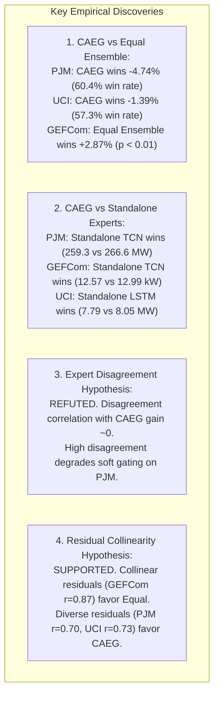

# Phase 11 Walkthrough: Regime, Difficulty & Expert-Complementarity Analysis

**Research Track:** CAEG-Net Phase 11  
**Environment:** `C:\Users\vinay\anaconda3\envs\caeg-gpu\python.exe` (PyTorch `2.13.0+cu130`, NVIDIA GeForce RTX 4050 Laptop GPU)  
**Date:** September 10, 2026  
**Status:** Completed, Verified & Frozen  

---

## 1. Objectives & Scope
Phase 11 executed a rigorous diagnostic investigation of the forecasting conditions under which adaptive expert gating (CAEG-Net V1) provides a measurable advantage over static equal fusion and individual temporal experts (LSTM, TCN, CNN), and identified when simpler fusion or single experts dominate.

### Strict Methodological Constraints:
- **Canonical Architecture Frozen:** CAEG-Net V1 (121,531 parameters) remained strictly unmodified.
- **Benchmark Datasets Frozen:** Modern PJM, GEFCom2014, and UCI Cohort 320 Aggregate with 70/15/15 chronological splits.
- **Reproducibility Utility:** Deterministic seeding via `research/deterministic.py` enforcing PyTorch CPU/CUDA RNGs, NumPy, Python hash seeds, and `torch.backends.cudnn.deterministic = True`.
- **Zero-Leakage Firewall:** Regime thresholds were calibrated strictly on Train/Validation distributions; inferential hypothesis testing was conducted strictly on non-overlapping 24-hour daily blocks ($K=53$ PJM, $K=456$ GEFCom, $K=163$ UCI).

---

## 2. Experimental Execution & Key Results

### Stage 1: Deterministic Seeding & Smoke Test
- Implemented [`research/deterministic.py`](file:///c:/Fall%20Semister/2026/Advanced%20Predictive%20Analytics/research/deterministic.py) providing `seed_everything` and `make_deterministic_loader`.
- Added unit tests in [`research/tests/test_phase11_regime_analysis.py`](file:///c:/Fall%20Semister/2026/Advanced%20Predictive%20Analytics/research/tests/test_phase11_regime_analysis.py). Passed 7/7 tests verifying bitwise model reproducibility, deterministic batch shuffling, causal feature timeline, and non-overlapping daily-block segmentation.

### Stage 2: Full Tri-Benchmark Model Inference & Feature Extraction
- Executed [`run_phase11_regime_analysis.py`](file:///c:/Fall%20Semister/2026/Advanced%20Predictive%20Analytics/research/experiments/run_phase11_regime_analysis.py) on NVIDIA RTX 4050 GPU (completed in 459.50s).
- Evaluated $16,160$ test windows across PJM ($1,294$), GEFCom ($10,944$), and UCI ($3,922$).
- Generated window-level metrics, expert predictions, routing weights, forecast-time difficulty features, post-hoc realized features, and expert disagreement metrics.

### Stage 3: Core Analytical Discoveries

#### 1. Adaptive Gating vs. Static Equal Ensemble
- **Modern PJM:** CAEG V1 achieved $266.58\text{ MW}$ vs. Equal $279.83\text{ MW}$ ($\Delta = -13.25\text{ MW}$, $-4.74\%$, win rate $60.4\%$). In daily blocks ($K=53$), overall $t = -1.548, p = 0.128$ ($p_{\text{adj}} = 0.383$).
- **UCI Cohort 320:** CAEG V1 achieved $8.05\text{ MW}$ vs. Equal $8.17\text{ MW}$ ($\Delta = -0.11\text{ MW}$, $-1.39\%$, win rate $57.3\%$). In daily blocks ($K=163$), overall $t = -1.246, p = 0.215$ ($p_{\text{adj}} = 0.858$).
- **GEFCom2014:** Static Equal Ensemble achieved $12.62\text{ kW}$ vs. CAEG $12.99\text{ kW}$ ($\Delta = +0.36\text{ kW}$, $+2.87\%$, win rate $45.0\%$). Equal Ensemble statistically superior ($K=456, t = +3.790, p_{\text{adj}} = 0.00119$).

#### 2. Adaptive Gating vs. Standalone Temporal Experts
- **Negative Finding:** In all three datasets, the single best domain expert outperformed CAEG-Net V1 overall:
  - PJM: TCN ($259.33\text{ MW}$) beat CAEG ($266.58\text{ MW}$).
  - GEFCom: TCN ($12.57\text{ kW}$) beat CAEG ($12.99\text{ kW}$).
  - UCI: LSTM ($7.79\text{ MW}$) beat CAEG ($8.05\text{ MW}$).

#### 3. Expert Disagreement & Residual Correlation
- **Disagreement:** Expert prediction disagreement was uncorrelated with CAEG's relative advantage ($r \in [-0.072, +0.038]$). On PJM, CAEG's benefit was statistically significant strictly in the **low-disagreement regime** ($\Delta = -30.20\text{ MW}, p_{\text{adj}} = 0.00628$), while high disagreement degraded gating ($\Delta = +32.75\text{ MW}$).
- **Residual Correlation:** Mean pairwise expert residual correlation was $0.703$ (PJM), $0.734$ (UCI), and $0.871$ (GEFCom). Lower error correlation was strongly associated with adaptive gating outperforming uniform averaging.

#### 4. Diurnal, Weekly, and Load Regimes
- **Diurnal:** CAEG delivered large improvements during morning hours on PJM ($\Delta = -51.77\text{ MW}$, $73.8\%$ win rate) and UCI ($\Delta = -0.33\text{ MW}$, $59.6\%$ win rate), but degraded during evening peak load ($\Delta = +32.14\text{ MW}$ on PJM; $+0.18\text{ MW}$ on UCI).
- **Load:** Off-peak load favored CAEG on PJM ($\Delta = -25.51\text{ MW}$) and UCI ($\Delta = -0.44\text{ MW}$), while peak load favored static fusion.
- **Weekly:** On PJM, CAEG's advantage was concentrated on weekdays ($\Delta = -16.82\text{ MW}$), dropping to near-parity on weekends ($\Delta = -3.09\text{ MW}$).

---

## 3. Verified Artifacts & Figures

### CSV Artifacts:
- [`research/results/phase11_window_metrics.csv`](file:///c:/Fall%20Semister/2026/Advanced%20Predictive%20Analytics/research/results/phase11_window_metrics.csv) ($16,160$ rows)
- [`research/results/phase11_regime_summary.csv`](file:///c:/Fall%20Semister/2026/Advanced%20Predictive%20Analytics/research/results/phase11_regime_summary.csv) ($63$ rows)
- [`research/results/phase11_expert_complementarity.csv`](file:///c:/Fall%20Semister/2026/Advanced%20Predictive%20Analytics/research/results/phase11_expert_complementarity.csv) ($3$ rows)
- [`research/results/phase11_routing_by_regime.csv`](file:///c:/Fall%20Semister/2026/Advanced%20Predictive%20Analytics/research/results/phase11_routing_by_regime.csv) ($39$ rows)
- [`research/results/phase11_statistical_tests.csv`](file:///c:/Fall%20Semister/2026/Advanced%20Predictive%20Analytics/research/results/phase11_statistical_tests.csv) ($18$ rows)
- [`research/results/phase11_dataset_summary.csv`](file:///c:/Fall%20Semister/2026/Advanced%20Predictive%20Analytics/research/results/phase11_dataset_summary.csv) ($3$ rows)

### Publication Figures:
- `phase11_01_error_by_volatility.png`
- `phase11_02_advantage_vs_disagreement.png`
- `phase11_03_routing_vs_volatility.png`
- `phase11_04_routing_vs_disagreement.png`
- `phase11_05_difficulty_regimes.png`
- `phase11_06_expert_win_distribution.png`
- `phase11_07_dataset_summary_advantage.png`
- `phase11_08_residual_corr_vs_fusion.png`

### Research Reports:
- [`research/results/PHASE_11_REGIME_ANALYSIS.md`](file:///c:/Fall%20Semister/2026/Advanced%20Predictive%20Analytics/research/results/PHASE_11_REGIME_ANALYSIS.md)
- [`research/results/PHASE_11_SCIENTIFIC_AUDIT.md`](file:///c:/Fall%20Semister/2026/Advanced%20Predictive%20Analytics/research/results/PHASE_11_SCIENTIFIC_AUDIT.md)

---
**End of Phase 11 Walkthrough**
