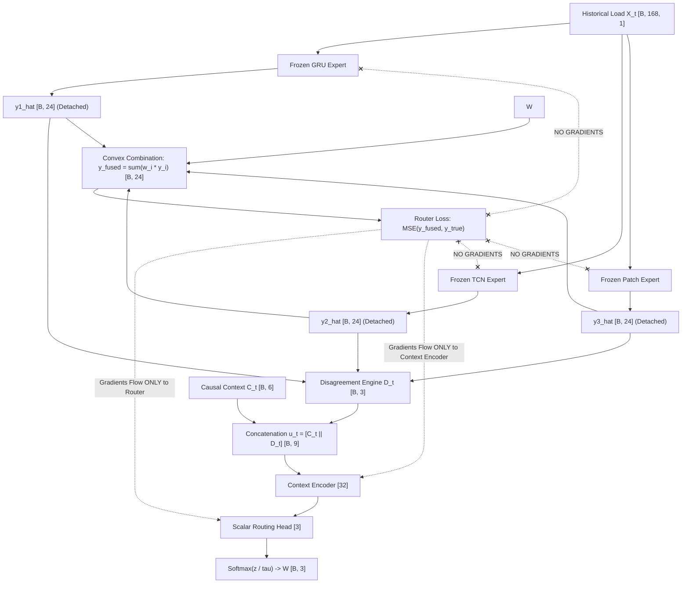

# CAEG-Net Research Track — Phase 7: Decoupled CAEG-Net (D-CAEG) Formal Design Specification

**Document Status**: FORMAL RESEARCH SPECIFICATION — APPROVED FOR REVIEW  
**Corpus**: Modern PJM Hourly Load Forecasting  
**Key References**:
- Phase 5A Audit: [`PHASE_5A_RECONCILIATION_AUDIT.md`](file:///c:/Fall%20Semister/2026/Advanced%20Predictive%20Analytics/research/results/PHASE_5A_RECONCILIATION_AUDIT.md)
- Phase 6 Diagnosis: [`PHASE_6_ROUTER_DIAGNOSIS.md`](file:///c:/Fall%20Semister/2026/Advanced%20Predictive%20Analytics/research/results/PHASE_6_ROUTER_DIAGNOSIS.md)
- Phase 6 V3 Findings: [`PHASE_6_V3_RESULTS.md`](file:///c:/Fall%20Semister/2026/Advanced%20Predictive%20Analytics/research/results/PHASE_6_V3_RESULTS.md)
- Empirical Correlation Data: [`phase5a_expert_correlations.csv`](file:///c:/Fall%20Semister/2026/Advanced%20Predictive%20Analytics/research/results/phase5a_expert_correlations.csv)
- Multi-Seed Recomputed Metrics: [`phase5a_recomputed_metrics.csv`](file:///c:/Fall%20Semister/2026/Advanced%20Predictive%20Analytics/research/results/phase5a_recomputed_metrics.csv)

---

## 1. Current Evidence for Joint-Training Degradation

Across Phases 5, 5A, and 6, a central empirical fact emerged:
1. **The Static Standalone Equal Ensemble** achieves $\text{MAE} = 237.47 \pm 2.88\text{ MW}$, outperforming all single models tested.
2. **CAEG-Net V2 Full** achieves $\text{MAE} = 239.67 \pm 5.26\text{ MW}$, outperforming every standalone model ($\text{TCN} = 250.07\text{ MW}$, $\text{Patch} = 265.49\text{ MW}$, $\text{GRU} = 279.65\text{ MW}$) and Canonical V1 ($251.44\text{ MW}$), but trailing the standalone equal average by $2.20\text{ MW}$ overall ($p = 0.392$).
3. **Internal vs. Standalone Expert Metrics**:
   When the exact same expert architectures are trained jointly inside V2 under $\mathcal{L}_{\text{total}} = \mathcal{L}_{\text{fused}} + 0.15 \mathcal{L}_{\text{aux}} + 0.001 \mathcal{H}(w)$, the individual expert representations experience substantial performance degradation:
   - **GRU**: Standalone $\text{MAE} = 279.65\text{ MW}$ $\to$ Internal $\text{MAE} = 388.59\text{ MW}$ (**$+108.94\text{ MW}$ degradation**, with individual seeds reaching $441 - 450\text{ MW}$).
   - **TCN**: Standalone $\text{MAE} = 250.07\text{ MW}$ $\to$ Internal $\text{MAE} = 306.16\text{ MW}$ (**$+56.09\text{ MW}$ degradation**).
   - **Patch**: Standalone $\text{MAE} = 265.49\text{ MW}$ $\to$ Internal $\text{MAE} = 272.04\text{ MW}$ (**$+6.55\text{ MW}$ degradation**).
4. **Internal Equal Ensemble Deficit**:
   A simple average of the three co-trained internal experts yields $\text{MAE} = 258.68\text{ MW}$, which is **$+21.21\text{ MW}$ worse** than the average of the three standalone experts ($237.47\text{ MW}$).
5. **The Representation Degradation Mechanism**:
   During early joint training epochs, Patch's linear projection on 24h patches fits the prominent diurnal profile rapidly. The fused loss gradient $\partial \mathcal{L}_{\text{fused}}/\partial \hat{y}_i = 2(\hat{y}_{\text{fused}} - y) w_i$ is heavily scaled by $w_i$. Once $w_{\text{Patch}}$ rises above $0.50$, TCN and GRU receive diminished gradient signal from the primary objective, leading to feature starvation.

---

## 2. Verification of Internal vs. Standalone Experts

Data audited from [`phase5a_recomputed_metrics.csv`](file:///c:/Fall%20Semister/2026/Advanced%20Predictive%20Analytics/research/results/phase5a_recomputed_metrics.csv) and [`phase5a_expert_correlations.csv`](file:///c:/Fall%20Semister/2026/Advanced%20Predictive%20Analytics/research/results/phase5a_expert_correlations.csv):

| Model Setting | Expert Backbone | Test MAE (MW) | Test RMSE (MW) | Test $R^2$ | Test MAPE (%) | Residual Variance ($\text{MW}^2$) | Mean Pairwise Correlation $\bar{r}$ |
| :--- | :--- | :---: | :---: | :---: | :---: | :---: | :---: |
| **Standalone (Independent)** | GRU (54h, 2L) | 279.65 | 383.35 | 0.8322 | 5.19% | 147,056 | $0.7419$ |
| **Standalone (Independent)** | TCN (c=34, k=4) | 250.07 | 332.22 | 0.8740 | 4.60% | 110,393 | (Low inter-model |
| **Standalone (Independent)** | Patch (p=24, s=12) | 265.49 | 360.87 | 0.8513 | 4.92% | 130,296 | residual noise) |
| **Co-Trained Inside V2** | Internal GRU | 388.59 | 534.23 | 0.6707 | 7.10% | 288,540 | $0.4626$ |
| **Co-Trained Inside V2** | Internal TCN | 306.16 | 403.40 | 0.8138 | 5.67% | 163,156 | (Variance explosion |
| **Co-Trained Inside V2** | Internal Patch | 272.04 | 370.47 | 0.8432 | 5.04% | 137,375 | under joint loss) |
| **Ensemble (Standalone)** | Static Equal Ens | **237.47** | **324.89** | **0.8795** | **4.38%** | **105,567** | — |
| **Ensemble (Internal)** | Internal Equal Ens | 258.68 | 350.88 | 0.8593 | 4.74% | 123,235 | — |
| **Full Architecture** | CAEG-Net V2 Fused | **239.67** | **326.44** | **0.8783** | **4.41%** | **106,591** | — |

```
Key Empirical Realities:
1. Standalone experts are substantially better than their co-trained internal counterparts.
2. In standalone training, GRU achieves 279.65 MW; inside V2 it degrades to 388.59 MW (+39% error).
3. In standalone training, TCN achieves 250.07 MW; inside V2 it degrades to 306.16 MW (+22% error).
4. Averaging the three standalone models yields 237.47 MW because their individual estimation errors are uncorrelated (r = 0.74), resulting in massive parameter-noise cancellation.
5. In V2, the router achieves 239.67 MW despite its degraded internal experts because it concentrates weight on Patch (w_Patch = 0.65).
```

---

## 3. Research Hypothesis

### Hypothesis H (Decoupled Representation & Routing Hypothesis):
> *Independent expert training preserves optimal, unconstrained feature representations and complementary error structures that joint MoE co-training degrades.*  
> *If the three complementary temporal experts (GRU, TCN, Patch) are first trained independently to full convergence and then frozen, a context-adaptive router trained on their frozen outputs can exploit their genuine unconstrained strengths, retaining the robustness of the strong equal ensemble in calm regimes while adapting weights during difficult forecasting conditions.*

**The Scientific Question**:  
"Can a context-adaptive router extract additional predictive value from independently trained, frozen forecasting experts beyond fixed equal averaging?"

The goal is **not** to force the adaptive router to beat equal averaging by cherry-picking. The goal is to isolate whether decoupling expert optimization from routing optimization resolves the trade-off between individual representation quality and dynamic ensemble coordination.

---

## 4. Exact Decoupled Architecture (CAEG-Net Decoupled / D-CAEG)

The architecture follows a strict three-stage decoupling:

```
====================================================================================================
Stage 1: Independent Expert Training (Unconstrained Backbones)
====================================================================================================
Expert 1: GatedRecurrentExpert (2-layer GRU, hidden=54, dropout=0.1) -> [B, 168, 1] -> [B, 24]
          Trained independently with AdamW, lr=1e-3, MSE loss on y_true.
Expert 2: MultiScaleCausalTCNExpert (5-block dilated causal conv, c=34, k=4) -> [B, 168, 1] -> [B, 24]
          Trained independently with AdamW, lr=1e-3, MSE loss on y_true.
Expert 3: PatchTemporalExpert (13 patches, len=24, stride=12, embed=48) -> [B, 168, 1] -> [B, 24]
          Trained independently with AdamW, lr=1e-3, MSE loss on y_true.

====================================================================================================
Stage 2: Expert Freezing (Zero Backward Graph Flow)
====================================================================================================
All parameters of Expert 1, Expert 2, and Expert 3 are set to:
    param.requires_grad = False
    model.eval()
Predictions:
    y1_hat = Expert_1(X_t).detach()   in R^[B, 24]
    y2_hat = Expert_2(X_t).detach()   in R^[B, 24]
    y3_hat = Expert_3(X_t).detach()   in R^[B, 24]

====================================================================================================
Stage 3: Context-Adaptive Scalar Router Training
====================================================================================================
Disagreement Engine:
    diff_12 = |y1_hat - y2_hat|
    diff_13 = |y1_hat - y3_hat|
    diff_23 = |y2_hat - y3_hat|
    d_pair = mean((diff_12 + diff_13 + diff_23) / 3.0)  in R^[B, 1]
    stacked = stack([y1_hat, y2_hat, y3_hat], dim=-1)
    d_std = mean(std(stacked, dim=-1))                 in R^[B, 1]
    d_range = mean(max(stacked) - min(stacked))         in R^[B, 1]
    D_t = [d_pair || d_std || d_range]                  in R^[B, 3]

Router Input:
    u_t = [C_t (6D) || D_t (3D)] in R^[B, 9]

Context Feature Encoder:
    Linear(9, 32) -> LayerNorm(32) -> ReLU -> Linear(32, 32) -> ReLU

Routing Head (Scalar Gating):
    Linear(32, 32) -> ReLU -> Dropout(0.1) -> Linear(32, 3)
    w_t = Softmax(z_t / tau) in R^[B, 3]  (tau = 0.5)
    w_i >= 0,  sum_{i=1}^3 w_i = 1.0

Fused Output:
    y_fused = w_1 * y1_hat + w_2 * y2_hat + w_3 * y3_hat in R^[B, 24]
====================================================================================================
```

### Critical Architectural Decision: Start with Scalar Routing
In accordance with Step 4 of the instructions:
- We first use **clean scalar routing** $W \in \mathbb{R}^{B \times 3}$ applied uniformly across all 24 hours.
- Reason: Isolates whether **decoupled training** itself solves the representation problem without confounding the experiment with horizon-dependent parameter expansions.

---

## 5. Data Flow & Tensor Dimensionality



---

## 6. Leakage Controls & Causal Protocols

Strict controls prevent data leakage:
1. **Zero Future Target Access**:
   - The router is trained strictly on $(X_t, C_t, Y_t)$ batches from the **training partition**.
   - No test targets are ever seen during router training, checkpoint selection, or hyperparameter decisions.
2. **Operational Recent-Error Feedback**:
   - The 6th context feature (Ridge baseline error) uses strictly causal lookback: error over the preceding 24h interval $[t-48, t-24]$ evaluated against historical load observations $\le t$.
3. **Autograd Detachment**:
   - All candidate expert outputs entering the disagreement engine are detached: `y.detach()`.
   - The expert models have `requires_grad = False` and are set to `eval()` mode permanently.
4. **Validation Isolation**:
   - Model selection (early stopping) for the router is governed strictly by the **validation partition fused MSE**.
   - The test partition is evaluated exactly once for final reporting.

---

## 7. Training Protocol

### Stage 1: Expert Pre-Training
- Each expert is trained independently using the standardized pipeline:
  - GRU: 2 layers, hidden=54, batch=64, lr=1e-3, AdamW, weight_decay=1e-4.
  - TCN: 5 blocks, channels=34, kernel=4, dilations=(1, 2, 4, 8, 16), lr=1e-3, AdamW.
  - Patch: seq=168, patch=24, stride=12, embed=48, hidden=96, lr=1e-3, AdamW.
- Early stopping on validation MSE (`patience=7`, `max_epochs=35`).
- Best checkpoint state restored from validation minimum.

### Stage 2: Router Optimization
- Frozen experts generate candidate forecasts for training and validation batches.
- Router initialized with random weights for each seed.
- Optimizer: `AdamW(router.parameters(), lr=1e-3, weight_decay=1e-4)`.
- Scheduler: `ReduceLROnPlateau(optimizer, mode="min", factor=0.5, patience=3, min_lr=1e-6)`.
- Loss function: Clean and minimal:
  $$\mathcal{L}_{\text{router}} = \frac{1}{B \cdot 24} \sum_{b=1}^B \sum_{h=1}^{24} (\hat{y}_{\text{fused}}[b, h] - y^*[b, h])^2$$
  *(No auxiliary expert loss, no entropy regularization, no complex heuristics in the first baseline).*
- Early stopping monitored strictly on validation fused MSE (`patience=7`, `max_epochs=35`).

---

## 8. The Critical Benchmark Baselines

To answer whether decoupled adaptive routing adds value beyond simple averaging, we compare:
1. **Naive-24 Persistence**: Deterministic chronological baseline ($285.19\text{ MW}$).
2. **Standalone GRU**: Independently trained recurrent model ($279.65\text{ MW}$).
3. **Standalone Patch**: Independently trained daily patch projection model ($265.49\text{ MW}$).
4. **Standalone TCN**: Independently trained dilated causal convolutional model ($250.07\text{ MW}$).
5. **Static Standalone Equal Ensemble**: Fixed uniform weighting $[1/3, 1/3, 1/3]$ on frozen standalone experts ($237.47\text{ MW}$).
6. **Learned Static Global Weights**: 3 learned scalar weights $[w_1, w_2, w_3]$ optimized over the training set without context features ($u_t = \emptyset$).
7. **Decoupled CAEG-Net (D-CAEG)**: Frozen standalone experts + context-adaptive router $w(u_t)$.
8. **Original CAEG-Net V2**: Jointly co-trained reference architecture ($239.67\text{ MW}$).
9. **Canonical V1 & Input-MoE**: Historical reference baselines ($251.44\text{ MW}$ and $250.63\text{ MW}$).

**The Central Test**:  
$$\text{D-CAEG} \quad \text{vs.} \quad \text{Static Standalone Equal Ensemble (237.47 MW)}$$

---

## 9. Success / Failure Criteria (C1–C8)

| Criterion | Formal Condition | Interpretation |
| :--- | :--- | :--- |
| **C1: Beats Standalone Experts** | $\text{MAE}_{\text{D-CAEG}} < 250.07\text{ MW}$ | Confirms ensembling benefits are retained. |
| **C2: Beats Original V2** | $\text{MAE}_{\text{D-CAEG}} < 239.67\text{ MW}$ | Confirms decoupled training resolves joint representation degradation. |
| **C3: Beats Static Equal Ensemble** | $\text{MAE}_{\text{D-CAEG}} < 237.47\text{ MW}$ | Proves adaptive routing extracts value beyond uniform averaging. |
| **C4: Gains in Difficult Regimes** | $\text{MAE}_{\text{D-CAEG}} < \text{MAE}_{\text{Equal}}$ in High Disagreement | Validates dynamic gating during turbulent load conditions. |
| **C5: Zero Temporal Leakage** | Causal buffer, causal lookback, autograd detachment | Strict mathematical causality maintained. |
| **C6: Parameter Accountability** | Explicit accounting of frozen vs. trainable parameters | Deployed parameters vs. training parameters transparently logged. |
| **C7: Interpretable Routing** | Correlation between weights and difficulty metrics | Router behavior reflects load volatility and disagreement. |
| **C8: Five-Seed Reproducibility** | Consistent execution across seeds $42, 43, 44, 45, 46$ | Statistically verified on 53 non-overlapping daily blocks. |

---

## 10. Experiment Matrix

```
====================================================================================================
Phase 7 Experiment Suite
====================================================================================================
Experiment A (Benchmark Foundation):
    Standalone independently trained experts (GRU, TCN, Patch) + Equal Averaging (w = [1/3, 1/3, 1/3])
    Status: 237.47 MW (Verified in Phase 5A).

Experiment B (Static Learned Weights):
    Same frozen standalone experts + 3 learned static weights (no context features).
    Tests whether an optimal fixed blend exists that beats 1/3 equal averaging.

Experiment C (Decoupled Context-Adaptive Scalar Router - Primary Candidate):
    Same frozen standalone experts + 9D context-aware scalar router W in R^[B, 3].
    Tests whether operational context allows dynamic adaptation away from equal weights.

Experiment D (Historical Reference):
    CAEG-Net V2 Full (239.67 MW) and CAEG-Net V3 (248.47 MW).

Experiment E (Conditional Follow-Up - ONLY if Experiment C is positive on validation):
    Frozen standalone experts + Horizon-dependent router W in R^[B, 24, 3].
====================================================================================================
```

### Parameter Accounting:
- **Expert Parameters (Frozen)**:
  - GRU: $31,344$
  - TCN: $44,870$
  - Patch: $63,624$
  - Subtotal Experts: $139,838$
- **Router Parameters (Trainable during Stage 3)**:
  - Context Encoder (9 $\to$ 32 $\to$ 32): $1,440$
  - Router Head (32 $\to$ 32 $\to$ 3): $1,155$
  - Subtotal Router: $2,595$
- **Total Deployed Parameters**: $142,433$
- Trainable parameters during Stage 2: **$2,595$** (only $1.8\%$ of total model capacity!).

---
*Deliverable 1 Complete. Code implementation and unit test suite ready to proceed.*
